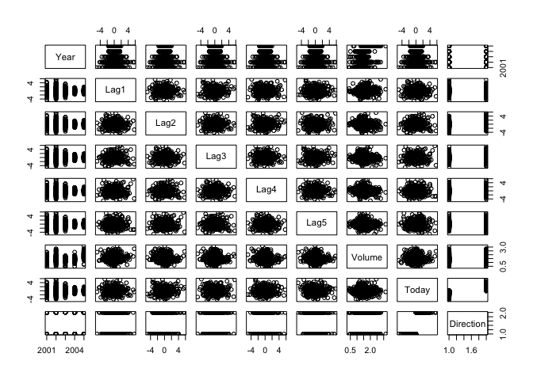
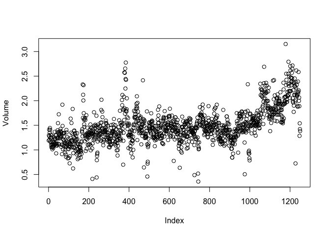
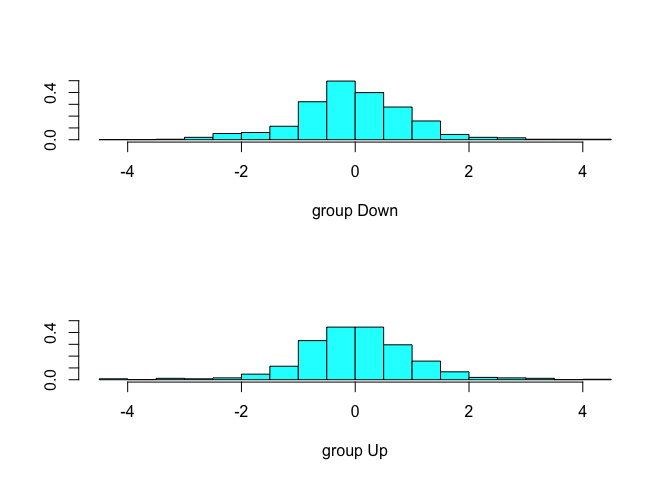

classification\_isl.Rmd
================

ISL Lab: Classification
=======================

``` r
library(ISLR)
```

``` r
dim(Smarket)
```

    ## [1] 1250    9

``` r
head(Smarket)
```

    ##   Year   Lag1   Lag2   Lag3   Lag4   Lag5 Volume  Today Direction
    ## 1 2001  0.381 -0.192 -2.624 -1.055  5.010 1.1913  0.959        Up
    ## 2 2001  0.959  0.381 -0.192 -2.624 -1.055 1.2965  1.032        Up
    ## 3 2001  1.032  0.959  0.381 -0.192 -2.624 1.4112 -0.623      Down
    ## 4 2001 -0.623  1.032  0.959  0.381 -0.192 1.2760  0.614        Up
    ## 5 2001  0.614 -0.623  1.032  0.959  0.381 1.2057  0.213        Up
    ## 6 2001  0.213  0.614 -0.623  1.032  0.959 1.3491  1.392        Up

``` r
summary(Smarket)
```

    ##       Year           Lag1                Lag2          
    ##  Min.   :2001   Min.   :-4.922000   Min.   :-4.922000  
    ##  1st Qu.:2002   1st Qu.:-0.639500   1st Qu.:-0.639500  
    ##  Median :2003   Median : 0.039000   Median : 0.039000  
    ##  Mean   :2003   Mean   : 0.003834   Mean   : 0.003919  
    ##  3rd Qu.:2004   3rd Qu.: 0.596750   3rd Qu.: 0.596750  
    ##  Max.   :2005   Max.   : 5.733000   Max.   : 5.733000  
    ##       Lag3                Lag4                Lag5         
    ##  Min.   :-4.922000   Min.   :-4.922000   Min.   :-4.92200  
    ##  1st Qu.:-0.640000   1st Qu.:-0.640000   1st Qu.:-0.64000  
    ##  Median : 0.038500   Median : 0.038500   Median : 0.03850  
    ##  Mean   : 0.001716   Mean   : 0.001636   Mean   : 0.00561  
    ##  3rd Qu.: 0.596750   3rd Qu.: 0.596750   3rd Qu.: 0.59700  
    ##  Max.   : 5.733000   Max.   : 5.733000   Max.   : 5.73300  
    ##      Volume           Today           Direction 
    ##  Min.   :0.3561   Min.   :-4.922000   Down:602  
    ##  1st Qu.:1.2574   1st Qu.:-0.639500   Up  :648  
    ##  Median :1.4229   Median : 0.038500             
    ##  Mean   :1.4783   Mean   : 0.003138             
    ##  3rd Qu.:1.6417   3rd Qu.: 0.596750             
    ##  Max.   :3.1525   Max.   : 5.733000

``` r
pairs(Smarket)
```



Lots of randomness.

``` r
cor(Smarket[, 1:8])
```

    ##              Year         Lag1         Lag2         Lag3         Lag4
    ## Year   1.00000000  0.029699649  0.030596422  0.033194581  0.035688718
    ## Lag1   0.02969965  1.000000000 -0.026294328 -0.010803402 -0.002985911
    ## Lag2   0.03059642 -0.026294328  1.000000000 -0.025896670 -0.010853533
    ## Lag3   0.03319458 -0.010803402 -0.025896670  1.000000000 -0.024051036
    ## Lag4   0.03568872 -0.002985911 -0.010853533 -0.024051036  1.000000000
    ## Lag5   0.02978799 -0.005674606 -0.003557949 -0.018808338 -0.027083641
    ## Volume 0.53900647  0.040909908 -0.043383215 -0.041823686 -0.048414246
    ## Today  0.03009523 -0.026155045 -0.010250033 -0.002447647 -0.006899527
    ##                Lag5      Volume        Today
    ## Year    0.029787995  0.53900647  0.030095229
    ## Lag1   -0.005674606  0.04090991 -0.026155045
    ## Lag2   -0.003557949 -0.04338321 -0.010250033
    ## Lag3   -0.018808338 -0.04182369 -0.002447647
    ## Lag4   -0.027083641 -0.04841425 -0.006899527
    ## Lag5    1.000000000 -0.02200231 -0.034860083
    ## Volume -0.022002315  1.00000000  0.014591823
    ## Today  -0.034860083  0.01459182  1.000000000

Noticeable correlation between `Year` and `Volume`. There doesn't seem to be much of a relationship between the `Lag`s themselves or between them and `Today`.

``` r
plot(Smarket$Volume, ylab = 'Volume')
```



Volume appears to gradually be increasing over time here.

Goal: predict `Direction` using the `Lag`s and `Volume`.
--------------------------------------------------------

### Logistic Regression

``` r
# Setting family=binomial ensures we use logistic regression
glm.fit = glm(Direction~Lag1+Lag2+Lag3+Lag4+Lag5+Volume, data=Smarket, family=binomial)
summary(glm.fit)
```

    ## 
    ## Call:
    ## glm(formula = Direction ~ Lag1 + Lag2 + Lag3 + Lag4 + Lag5 + 
    ##     Volume, family = binomial, data = Smarket)
    ## 
    ## Deviance Residuals: 
    ##    Min      1Q  Median      3Q     Max  
    ## -1.446  -1.203   1.065   1.145   1.326  
    ## 
    ## Coefficients:
    ##              Estimate Std. Error z value Pr(>|z|)
    ## (Intercept) -0.126000   0.240736  -0.523    0.601
    ## Lag1        -0.073074   0.050167  -1.457    0.145
    ## Lag2        -0.042301   0.050086  -0.845    0.398
    ## Lag3         0.011085   0.049939   0.222    0.824
    ## Lag4         0.009359   0.049974   0.187    0.851
    ## Lag5         0.010313   0.049511   0.208    0.835
    ## Volume       0.135441   0.158360   0.855    0.392
    ## 
    ## (Dispersion parameter for binomial family taken to be 1)
    ## 
    ##     Null deviance: 1731.2  on 1249  degrees of freedom
    ## Residual deviance: 1727.6  on 1243  degrees of freedom
    ## AIC: 1741.6
    ## 
    ## Number of Fisher Scoring iterations: 3

None of the p-values are significant. The lowest belongs to `Lag1`, which makes sense because it represents the most recent predictor to today, but it is still high. These results mean there may not be a relationship between `Direction` and our predictors.

``` r
# Show sample predictions
contrasts(Smarket$Direction)  # 1 = Up and 0 = Down
```

    ##      Up
    ## Down  0
    ## Up    1

``` r
predictions = predict(glm.fit, type='response')
up_down_vec = rep("Up", 1250)
up_down_vec[predictions < 0.5] = 'Down'

# Now create a confusion matrix to see where our classifier went wrong
table(up_down_vec, Smarket$Direction)
```

    ##            
    ## up_down_vec Down  Up
    ##        Down  145 141
    ##        Up    457 507

Overall, our model was correct at rate (145+507)/1250=0.52, implying the error rate is 0.48. Looking deeper, the matrix shows that of the 141+507=648 days in which the market went up, our model also predicted up at rate 507/648=0.78. Of the 145+457=602 days in which the market went down, our model predicted down 145/602 times, for a rate of 0.24.

Now, let's see how our model performs if we test it on a test set.

``` r
# Split into train and test
train = Smarket[Smarket$Year < 2005,]
test = Smarket[Smarket$Year==2005,]
```

``` r
# Model
glm.fit = glm(Direction~Lag1+Lag2+Lag3+Lag4+Lag5+Volume, data=train, family=binomial)
glm.probs = predict(glm.fit, test, type='response')
```

``` r
# Prepare confusion matrix
glm.pred = rep('Down', 252)
glm.pred[glm.probs > 0.5] = 'Up'
table(glm.pred, Smarket[Smarket$Year==2005, 'Direction'])
```

    ##         
    ## glm.pred Down Up
    ##     Down   77 97
    ##     Up     34 44

``` r
# Test error rate
sum(glm.pred != Smarket[Smarket$Year==2005, 'Direction'])/nrow(test)
```

    ## [1] 0.5198413

The test error rate of approximately 52% is worse than the train error rate, which we expect. This is worse than random guessing.

What if we test a classifier that just uses `Lag1`, the predictor with the lowest p-value, to train a logistic regression model?

``` r
# Train and then make predictions
glm_1_pred = glm(Direction~Lag1, data=train, family=binomial)
glm_1_pred_probs = predict(glm_1_pred, test, type='response')

# Confusion matrix
glm_1_pred_preds = rep('Up', 252)
glm_1_pred_preds[glm_1_pred_probs < 0.5] = 'Down'
table(glm_1_pred_preds, test[, 'Direction'])
```

    ##                 
    ## glm_1_pred_preds Down  Up
    ##             Down   20  25
    ##             Up     91 116

And so now, our error rate is 116/252 = 46% approximately. This is an improvement. It may be interesting to see how correct we are when our model predicted the market to go up. This rate is 116/(116+91) = 56% approximately. Since this number is better than what we'd expect from just flipping a coin, this model could be useful to someone looking for a trading strategy, although this analysis is very surface level and would need more work.

### Linear Discriminant Analysis (LDA)

``` r
# lda() function is part of MASS library
library(MASS)
```

    ## Warning: package 'MASS' was built under R version 3.5.2

``` r
lda.fit = lda(Direction~Lag1+Lag2, data=train)
lda.fit
```

    ## Call:
    ## lda(Direction ~ Lag1 + Lag2, data = train)
    ## 
    ## Prior probabilities of groups:
    ##     Down       Up 
    ## 0.491984 0.508016 
    ## 
    ## Group means:
    ##             Lag1        Lag2
    ## Down  0.04279022  0.03389409
    ## Up   -0.03954635 -0.03132544
    ## 
    ## Coefficients of linear discriminants:
    ##             LD1
    ## Lag1 -0.6420190
    ## Lag2 -0.5135293

``` r
# plots linear discriminants, obtained by using all of the training observations
plot(lda.fit)
```



``` r
# predictions
lda.pred = predict(lda.fit, test)
lda.class = lda.pred$class
table(lda.class, test$Direction)
```

    ##          
    ## lda.class Down  Up
    ##      Down   35  35
    ##      Up     76 106

``` r
1 - (sum(lda.class == test$Direction)/nrow(test))  # error rate
```

    ## [1] 0.4404762

``` r
# Using threshold 0.5, we can recreate the "row sums" in the table to check our understanding:
num_downs = sum(lda.pred$posterior[, 1] >= 0.5)  # 35+35=70
num_ups = sum(lda.pred$posterior[, 1] < 0.5)  # 76+106=182
num_downs
```

    ## [1] 70

``` r
num_ups
```

    ## [1] 182

``` r
# we see that in the first column of posterior we check P(Down) using threshold 0.5 to make decisions
lda.pred$posterior[1:20, 1]
```

    ##       999      1000      1001      1002      1003      1004      1005 
    ## 0.4901792 0.4792185 0.4668185 0.4740011 0.4927877 0.4938562 0.4951016 
    ##      1006      1007      1008      1009      1010      1011      1012 
    ## 0.4872861 0.4907013 0.4844026 0.4906963 0.5119988 0.4895152 0.4706761 
    ##      1013      1014      1015      1016      1017      1018 
    ## 0.4744593 0.4799583 0.4935775 0.5030894 0.4978806 0.4886331

``` r
lda.pred$class[1:20]
```

    ##  [1] Up   Up   Up   Up   Up   Up   Up   Up   Up   Up   Up   Down Up   Up  
    ## [15] Up   Up   Up   Down Up   Up  
    ## Levels: Down Up

Let's say we wanted to use a different thershold, and to me it makes sense to check P(Down) using a low threshold, since with our market trading habits, it seems wiser to be conservative. For example, let's use 0.3 as our threshold.

``` r
sum(lda.pred$posterior[, 1] >= 0.3)  # number of Downs
```

    ## [1] 252

``` r
sum(lda.pred$posterior[, 1] < 0.3)  # number of Ups
```

    ## [1] 0

Wow! We wouldn't predict the market to go Up in any case here. Let's just see what the min probability is for fun...

``` r
min(lda.pred$posterior[,1])
```

    ## [1] 0.4577867

So about 0.46 was the lowest probability we predicted for the market to go Down. The 0.3 threshold may have been overkill!

### Quadratic Discriminant Analysis (QDA)

``` r
# QDA model
qda_fit = qda(Direction~Lag1+Lag2, data=train)
qda_fit
```

    ## Call:
    ## qda(Direction ~ Lag1 + Lag2, data = train)
    ## 
    ## Prior probabilities of groups:
    ##     Down       Up 
    ## 0.491984 0.508016 
    ## 
    ## Group means:
    ##             Lag1        Lag2
    ## Down  0.04279022  0.03389409
    ## Up   -0.03954635 -0.03132544

``` r
# predictions and error rate
qda_preds = predict(qda_fit, test)
1-(sum(qda_preds$class == test$Direction)/nrow(test))
```

    ## [1] 0.4007937

This error rate is better than that of LDA. Cool!

### K-Nearest Neighbors (KNN)

``` r
# knn() function is in the class library
library(class)
# Make train and test sets
X_train = cbind(train$Lag1, train$Lag2)
X_test = cbind(test$Lag1, test$Lag2)
```

``` r
set.seed(1)
# fit and predict
knn_preds = knn(X_train, X_test, train$Direction, k=1)
table(knn_preds, test$Direction)
```

    ##          
    ## knn_preds Down Up
    ##      Down   43 58
    ##      Up     68 83

``` r
# error rate
1 - ((83+43)/252)
```

    ## [1] 0.5

This 0.5 error rate isn't so good, probably because we overfit with the choice of `k=1` neighbor considered. Let's try `k=3`.

``` r
# fit and predict
knn_preds = knn(X_train, X_test, train$Direction, k=3)
table(knn_preds, test$Direction)
```

    ##          
    ## knn_preds Down Up
    ##      Down   48 54
    ##      Up     63 87

``` r
# error rate
1 - ((48+87)/252)
```

    ## [1] 0.4642857

This error rate of 0.46 is better, but still not as good as the QDA fit from earlier. The QDA choice may have been best!

### KNN on different data set

In this part of the lab, we want to predict if a given person purchased caravan insurance or not. We'll use the Caravan data set.

``` r
dim(Caravan)
```

    ## [1] 5822   86

``` r
#head(Caravan)
```

``` r
sum(Caravan$Purchase == 'Yes')/nrow(Caravan)
```

    ## [1] 0.05977327

So, only 6% of people bought caravan insurance.

``` r
# Standardize the data to avoid issues with KNN distances. This means giving all variables a mean of 0 and variance of 1.
X_standardized = scale(Caravan[, -86])

# check
var(X_standardized[, 3])
```

    ## [1] 1

``` r
var(X_standardized[, 4])
```

    ## [1] 1

``` r
mean(X_standardized[, 3])
```

    ## [1] -1.780112e-16

``` r
mean(X_standardized[, 4])
```

    ## [1] 2.042807e-16

``` r
# split data
test_indices = 1:1000
X_train = X_standardized[-test_indices, ]
X_test = X_standardized[test_indices, ]
y_train = Caravan$Purchase[-test_indices]
y_test = Caravan$Purchase[test_indices]

# make predictions
set.seed(1)
knn_preds = knn(X_train, X_test, y_train, k=1)
1 - (mean(y_test == knn_preds))  # error rate
```

    ## [1] 0.118

This error rate seems low, but it doesn't seem that great when we remember that since only 6% of customers bought caravan insurance, the error rate for a classifier that only predicted `No` would be 6%.

Let's see how good the classifier is at predicting customers who will actually buy insurance.

``` r
table(knn_preds, y_test)
```

    ##          y_test
    ## knn_preds  No Yes
    ##       No  873  50
    ##       Yes  68   9

And so, of the 77 people we predicted to buy insurance, 9 actually did, for a rate of 9/77 which is about 12%. Had we just guessed `Yes` randomly, we would've been right only 6% of the time, so our classifier does twice as good in this case.

``` r
# Let's try different values of k...
knn_preds = knn(X_train, X_test, y_train, k=3)
table(knn_preds, y_test)
```

    ##          y_test
    ## knn_preds  No Yes
    ##       No  920  54
    ##       Yes  21   5

``` r
knn_preds = knn(X_train, X_test, y_train, k=5)
table(knn_preds, y_test)
```

    ##          y_test
    ## knn_preds  No Yes
    ##       No  930  55
    ##       Yes  11   4

Respectively, we get rates of about 19% and 27% with k=3 and k=5. (These rates are the same as the one discussed above... the proportion of correct predictions to buy interest). Big improvements!

``` r
#model
glm_fit = glm(Purchase~., data=Caravan, subset=-test_indices, family=binomial)
```

    ## Warning: glm.fit: fitted probabilities numerically 0 or 1 occurred

``` r
glm_probs = predict(glm_fit, Caravan[test_indices, ], type='response')
glm_pred = rep('No', 1000)
glm_pred[glm_probs > 0.5] = 'Yes'
table(glm_pred, y_test)
```

    ##         y_test
    ## glm_pred  No Yes
    ##      No  934  59
    ##      Yes   7   0

Unfortunately here we are wrong 100% of the time.

``` r
glm_pred = rep('No', 1000)
glm_pred[glm_probs > 0.25] = 'Yes'
table(glm_pred, y_test)
```

    ##         y_test
    ## glm_pred  No Yes
    ##      No  919  48
    ##      Yes  22  11

``` r
11/33  # success rate
```

    ## [1] 0.3333333

Here, our success rate is 1/3. This is better than what we saw above with KNN!
