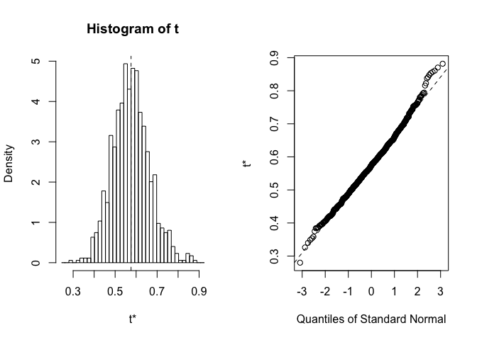

cross\_validation\_and\_bootstrap.Rmd
================

ISL Lab: Cross-Validation and the Bootstrap
===========================================

### Validation Set Approach

``` r
library(ISLR)
set.seed(1)
# generate random training data
train = sample(392, 196)

# Use Auto data to fit a linear regression model
lm_fit = lm(mpg~horsepower, data=Auto, subset=train)

# Make predictions and calculate MSE
mean((Auto$mpg - predict(lm_fit, Auto))[-train]^2)
```

    ## [1] 26.14142

So the MSE here is 26.14. Earlier in the book we saw polynomial regression might work better than OLS. Let's try them here...

``` r
lm_fit2 = lm(mpg~poly(horsepower, 2), data=Auto, subset=train)
print(paste("Second degree polynomial MSE:", mean((Auto$mpg - predict(lm_fit2, Auto))[-train]^2), sep=" "))
```

    ## [1] "Second degree polynomial MSE: 19.8225850408262"

``` r
lm_fit3 = lm(mpg~poly(horsepower, 3), data=Auto, subset=train)
print(paste("Third degree polynomial MSE:", mean((Auto$mpg - predict(lm_fit3, Auto))[-train]^2), sep=" "))
```

    ## [1] "Third degree polynomial MSE: 19.7825166856023"

So, these models give a better MSE than what we saw with OLS. Note that in this example we used the syntax `-train` when calculating the MSE to get our validation set. Now, if we generate new data, let's see what happens...

``` r
# repeating what was done above
set.seed(2)
# generate random training data
train = sample(392, 196)

# Use Auto data to fit a linear regression model
lm_fit = lm(mpg~horsepower, data=Auto, subset=train)

# Make predictions and calculate MSE
print(paste("OLS MSE:", mean((Auto$mpg - predict(lm_fit, Auto))[-train]^2), sep=" "))
```

    ## [1] "OLS MSE: 23.2955851508862"

``` r
lm_fit2 = lm(mpg~poly(horsepower, 2), data=Auto, subset=train)
print(paste("Second degree polynomial MSE:", mean((Auto$mpg - predict(lm_fit2, Auto))[-train]^2), sep=" "))
```

    ## [1] "Second degree polynomial MSE: 18.9012408317778"

``` r
lm_fit3 = lm(mpg~poly(horsepower, 3), data=Auto, subset=train)
print(paste("Third degree polynomial MSE:", mean((Auto$mpg - predict(lm_fit3, Auto))[-train]^2), sep=" "))
```

    ## [1] "Third degree polynomial MSE: 19.2573982608642"

Since the data is different, we get slightly different MSEs. This iteration was useful though, since we see that the second degree polynomial regression performs best.

### Leave-One-Out Cross-Validation

``` r
# LOOCV's cv.glm() is part of the boot library
library(boot)
# simple OLS regression
glm_fit = glm(mpg~horsepower, data=Auto)
# default value for K is nrows(data), so this is effectively LOOCV
cv_error = cv.glm(Auto, glm_fit)
cv_error$delta  # the cross-val estimate of test error
```

    ## [1] 24.23151 24.23114

Let's repeat this process with increasing degrees of polynomials, up to 5.

``` r
cv_errors = rep(0, 5)
for (deg in 1:5) {
  model = glm(mpg~poly(horsepower, deg), data=Auto)
  cv_errors[deg] = cv.glm(Auto, model)$delta[1]
}

cv_errors
```

    ## [1] 24.23151 19.24821 19.33498 19.42443 19.03321

From these results, we see the polynomial degree increase from 1 to 2 had a big effect on the cross-val test error estimate. From degree 2 onwards, we see some improvement, but it seems marginal at best.

### k-Fold Cross Validation

``` r
# Follow the same for loop approach as above, this time setting K=10
set.seed(3)
cv_errors = rep(0, 10)
for (i in 1:10) {
  model = glm(mpg~poly(horsepower, i), data=Auto)
  cv_errors[i] = cv.glm(Auto, model, K=10)$delta[1]
}

cv_errors
```

    ##  [1] 24.44562 19.18173 19.40868 19.29196 18.93502 19.01750 18.44798
    ##  [8] 19.05446 19.12885 19.66910

We see similar results. The most noticeable thing was the runtime of this chunk was a lot faster than that of LOOCV.

### The Bootstrap

First, we estimate the accuracy of a statistic of interest
----------------------------------------------------------

``` r
# Takes in the data, and a vector indicating which observations will be used to estimate our parameter of interest, alpha. Then returns alpha based on formula on p. 187
alpha_estimator = function(data, index) {
  X = data$X[index]
  Y = data$Y[index]
  alpha = ((var(Y) - cov(X, Y)) / (var(X) + var(Y) - 2*cov(X, Y)))
  return(alpha)
}

set.seed(1)
# Use sample() with the Portfolio data set to select 100 observations from 1:100, with replacement. This is effecitvely our bootstrap data set
alpha_estimator(Portfolio, sample(100, 100, replace=T))
```

    ## [1] 0.5963833

This is one estimate for alpha. Now, if we repeat this many times, we can plot the distribution of our estimates, and find its SD. We use the `boot` library to do this.

``` r
library(boot)
stats = boot(Portfolio, alpha_estimator, R=1000)
plot(stats)
```



``` r
stats
```

    ## 
    ## ORDINARY NONPARAMETRIC BOOTSTRAP
    ## 
    ## 
    ## Call:
    ## boot(data = Portfolio, statistic = alpha_estimator, R = 1000)
    ## 
    ## 
    ## Bootstrap Statistics :
    ##      original        bias    std. error
    ## t1* 0.5758321 -7.315422e-05  0.08861826

In the plot, the distribution of our estimates looks approximately normal. The output tells us our prediction for alpha = 0.5758, with standard deviation 0.0886.

### Estimating the accuracy of a linear regression model.

Here we use the bootstrap to analyze the variability of the coefficients in the linear regression model of `mpg~horswepower`.

``` r
# Returns coefficients of linear regression model
boot_fn = function(data, index) {
  return(coef(lm(mpg~horsepower, data=data, subset=index)))
}

# Use all 392 observations to obtain coefficients
boot_fn(Auto, 1:392)
```

    ## (Intercept)  horsepower 
    ##  39.9358610  -0.1578447

``` r
# Now use boot() to generate standard error estimates for 1000 estimates of the two coefficients
boot(Auto, boot_fn, R=1000)
```

    ## 
    ## ORDINARY NONPARAMETRIC BOOTSTRAP
    ## 
    ## 
    ## Call:
    ## boot(data = Auto, statistic = boot_fn, R = 1000)
    ## 
    ## 
    ## Bootstrap Statistics :
    ##       original        bias    std. error
    ## t1* 39.9358610  0.0126152644 0.871267432
    ## t2* -0.1578447 -0.0002691801 0.007540188

So, the SE of the intercept term is 0.85 and that of the slope term is 0.007. How do these compare to the SEs of just one regression using all the data?

``` r
summary(lm(mpg~horsepower, data=Auto))
```

    ## 
    ## Call:
    ## lm(formula = mpg ~ horsepower, data = Auto)
    ## 
    ## Residuals:
    ##      Min       1Q   Median       3Q      Max 
    ## -13.5710  -3.2592  -0.3435   2.7630  16.9240 
    ## 
    ## Coefficients:
    ##              Estimate Std. Error t value Pr(>|t|)    
    ## (Intercept) 39.935861   0.717499   55.66   <2e-16 ***
    ## horsepower  -0.157845   0.006446  -24.49   <2e-16 ***
    ## ---
    ## Signif. codes:  0 '***' 0.001 '**' 0.01 '*' 0.05 '.' 0.1 ' ' 1
    ## 
    ## Residual standard error: 4.906 on 390 degrees of freedom
    ## Multiple R-squared:  0.6059, Adjusted R-squared:  0.6049 
    ## F-statistic: 599.7 on 1 and 390 DF,  p-value: < 2.2e-16

So, the SE comparisons are the following, in order (regression summary SE, bootstrap estimate) for intercept and then slope: (0.717, 0.847) and (0.006, 0.007). These are different. Why? The standard formulas given on p. 66 rely on several assumptions. For example, they depend on the unknown noise variance, estimated using the RSS. The estimate of this parameter depends on the linear model being correct, which we know isn't (we've seen the quadratic fit is better). So the residuals from a linear fit will be inflated, and so will this variance parameter. And, the standard formulas assume that the observations are fixed, and all the variability comes from the variation in the true errors between the predicted values and the population regression line. The bootstrap does not depend on any of these assumptions, and so it is likely giving a more accurate estimate of the standard errors than summary().

With this in mind, let's run a bootstrap to see what the variability in the SEs is if we instead choose the quadratic model...

``` r
# modify boot_fn to this time be a polynomial regression of degree 2
boot_fn_2 = function(data, index) {
  return(coef(lm(mpg~poly(horsepower, 2), data=data, subset=index)))
}

# find bootstrap SE estimates
boot(Auto, boot_fn_2, R=1000)
```

    ## 
    ## ORDINARY NONPARAMETRIC BOOTSTRAP
    ## 
    ## 
    ## Call:
    ## boot(data = Auto, statistic = boot_fn_2, R = 1000)
    ## 
    ## 
    ## Bootstrap Statistics :
    ##       original       bias    std. error
    ## t1*   23.44592  0.003034436   0.2221637
    ## t2* -120.13774  0.063930619   3.6699309
    ## t3*   44.08953 -0.071538569   4.4218215

``` r
# compare with what summary() tells us
summary(lm(mpg~poly(horsepower, 2), data=Auto))
```

    ## 
    ## Call:
    ## lm(formula = mpg ~ poly(horsepower, 2), data = Auto)
    ## 
    ## Residuals:
    ##      Min       1Q   Median       3Q      Max 
    ## -14.7135  -2.5943  -0.0859   2.2868  15.8961 
    ## 
    ## Coefficients:
    ##                       Estimate Std. Error t value Pr(>|t|)    
    ## (Intercept)            23.4459     0.2209  106.13   <2e-16 ***
    ## poly(horsepower, 2)1 -120.1377     4.3739  -27.47   <2e-16 ***
    ## poly(horsepower, 2)2   44.0895     4.3739   10.08   <2e-16 ***
    ## ---
    ## Signif. codes:  0 '***' 0.001 '**' 0.01 '*' 0.05 '.' 0.1 ' ' 1
    ## 
    ## Residual standard error: 4.374 on 389 degrees of freedom
    ## Multiple R-squared:  0.6876, Adjusted R-squared:  0.686 
    ## F-statistic:   428 on 2 and 389 DF,  p-value: < 2.2e-16

Now, we compare the following: (0.2209, 0.2156), (4.3739, 3.6796), and (4.3739, 4.3662). These are more similar, which makes sense given we used the better model this time!
