decision\_trees.Rmd
================

Lab: Decision Trees
===================

### In this lab, I'll apply the theory discussed in chapter 8. We'll see examples of regression and classification trees, bagging, random forests, and boosting.

The data set used in the beginning part of this lab is `Carseats`, and specifically we use its `Sales` column as the response.

``` r
# Classification tree
library(tree)
library(ISLR)

# If Sales <=8, assign No (meaning not high), and Yes otherwise. Gives us a binary vector.
High = ifelse(Carseats$Sales <= 8, 'No', 'Yes') 

Carseats = data.frame(Carseats, High)  # Merges High vector with data

# Fit classification tree
tree_high_carseats = tree(High~.-Sales, data=Carseats)
summary(tree_high_carseats)
```

    ## 
    ## Classification tree:
    ## tree(formula = High ~ . - Sales, data = Carseats)
    ## Variables actually used in tree construction:
    ## [1] "ShelveLoc"   "Price"       "Income"      "CompPrice"   "Population" 
    ## [6] "Advertising" "Age"         "US"         
    ## Number of terminal nodes:  27 
    ## Residual mean deviance:  0.4575 = 170.7 / 373 
    ## Misclassification error rate: 0.09 = 36 / 400

From these results, we see that 8/11 possible predictors were used. We also see the error rate is 9%, which looks low. The cool thing about trees is that we can plot them. Let's do that now.

``` r
plot(tree_high_carseats)
text(tree_high_carseats, pretty=0)
```

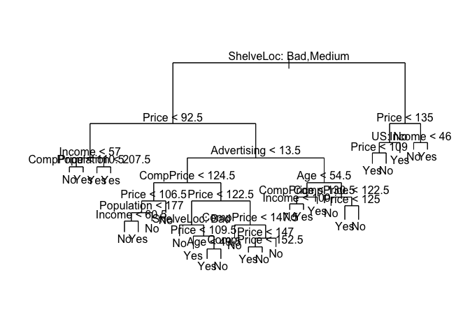

The plot is hard to read and has overlapping text, but at least we can tell that `ShelveLoc` seems to be the most important predictor. Let's estimate the test error!

``` r
# split into train and test
set.seed(2)
train = sample(1:nrow(Carseats), 200)
test = Carseats[-train, ]
test_high = High[-train]

# fit classifier
tree_carseats = tree(High ~ .-Sales, data=Carseats, subset=train)
# make predictions
tree_preds = predict(tree_carseats, test, type='class')

table(tree_preds, test_high)
```

    ##           test_high
    ## tree_preds  No Yes
    ##        No  104  33
    ##        Yes  13  50

This matrix implies our classifier is correct 154/200 = 77% of the time. This seems okay!

Now, we'll compare this result to pruning the tree, specifically using cost-complexity pruning. We'll use `cv.tree()` to perform cross-validation to select a subset of sub-trees to be considered, and use the classification error rate to prune the trees.

``` r
set.seed(3)
cv_carseats = cv.tree(tree_carseats, FUN=prune.misclass)  # classification error rate
names(cv_carseats)
```

    ## [1] "size"   "dev"    "k"      "method"

``` r
cv_carseats
```

    ## $size
    ## [1] 21 19 14  9  8  5  3  2  1
    ## 
    ## $dev
    ## [1] 74 76 81 81 75 77 78 85 81
    ## 
    ## $k
    ## [1] -Inf  0.0  1.0  1.4  2.0  3.0  4.0  9.0 18.0
    ## 
    ## $method
    ## [1] "misclass"
    ## 
    ## attr(,"class")
    ## [1] "prune"         "tree.sequence"

Note: the `size` corresponds to the number of leaves of each sub-tree, then we're given `dev`, which is actually the cv error rate, and then the `k` parameter which is actually *a**l**p**h**a* in the text. We see the tree with 21 leaves gave us the lowest error rate at 74, but the one with 8 is very close at 75. Let's plot these results!

``` r
par(mfrow = c(1, 2))
plot(cv_carseats$size, cv_carseats$dev, type='b')
plot(cv_carseats$k, cv_carseats$dev, type='b')
```

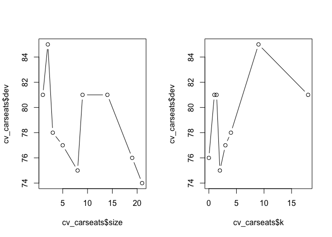

We'll now actually use `prune.misclass()` to prune the tree to get the one of 21 leaves.

``` r
pruned_carseats = prune.misclass(tree_carseats, best=21)
plot(pruned_carseats)
text(pruned_carseats, pretty=0)
```

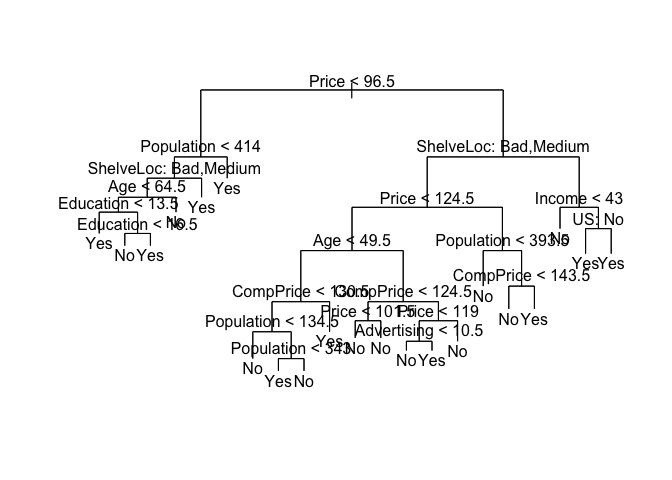

Cool! It's important to remember that this tree has 21 nodes, compared to our original tree, which had 27. This simplification is definitely an improvement. Let's take this tree and test it on the test data.

``` r
tree_preds = predict(pruned_carseats, test, type='class')
table(tree_preds, test_high)
```

    ##           test_high
    ## tree_preds  No Yes
    ##        No  104  32
    ##        Yes  13  51

Here, we se that this classifier is correct 155/200 = 77.5% of the time. This is 0.5% better than the first tree we saw.

We'll now look at regression trees using the `Boston` data set, and use it to predict `medv`, median house value.

``` r
# Regression trees
library(MASS)
set.seed(1)

# make train and test data
train = sample(1:nrow(Boston), nrow(Boston)/2)

# fit classifier
tree_boston = tree(medv ~ ., data=Boston, subset=train)
summary(tree_boston)
```

    ## 
    ## Regression tree:
    ## tree(formula = medv ~ ., data = Boston, subset = train)
    ## Variables actually used in tree construction:
    ## [1] "rm"    "lstat" "crim"  "age"  
    ## Number of terminal nodes:  7 
    ## Residual mean deviance:  10.38 = 2555 / 246 
    ## Distribution of residuals:
    ##     Min.  1st Qu.   Median     Mean  3rd Qu.     Max. 
    ## -10.1800  -1.7770  -0.1775   0.0000   1.9230  16.5800

Immediately we notice that only 4/14 variables have been included in our tree. We see the number of leaves and other information as well. Let's plot it.

``` r
# plot tree
plot(tree_boston)
text(tree_boston, pretty=0)
```

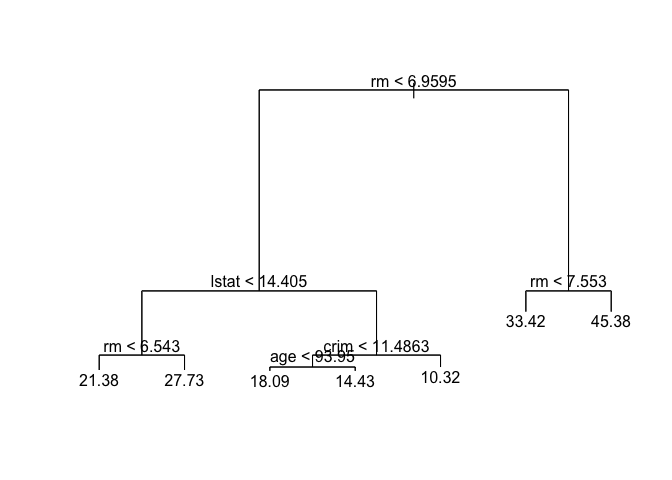

It's clear that `rm`, the average number of rooms per home, is an important factor, as it is the first split and the predictions to the right are larger than those to the left. Let's perform cross-validation to see if pruning will give us better performance.

``` r
cv_boston = cv.tree(tree_boston)
plot(cv_boston$size, cv_boston$dev, type='b')
```

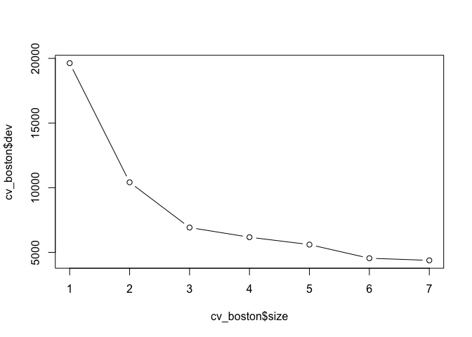

Hence, cross-validation selects the most complex tree (that with 7 terminal nodes). We can train this one and make predictions on the test set.

``` r
yhat = predict(tree_boston, newdata=Boston[-train, ])  # predictions on test set
boston_test = Boston[-train, 'medv']  # response
plot(yhat, boston_test)
abline(0, 1)
```

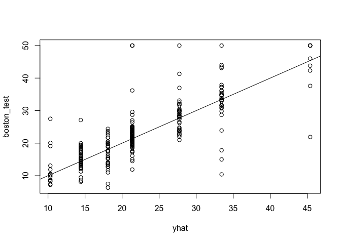

``` r
mean((yhat - boston_test)^2)
```

    ## [1] 35.28688

So, the test set MSE is slightly greater than 35. Hence, the square root MSE is almost 6, meaning that our model leads to predictions within about $6,000 of the true median home value for the suburb. Not bad!

### Bagging and Random Forests (again with the `Boston` data)

Note: since bagging is a special case of random forests with `m = p`, we don't need a whole separate package for bagging, we can just use `randomForest`.

``` r
library(randomForest)
```

    ## randomForest 4.6-14

    ## Type rfNews() to see new features/changes/bug fixes.

``` r
set.seed(1)

# fit bagging regressor
bag_boston = randomForest(medv~., data=Boston, subset=train, mtry=13, importance=T)  # mtry means all 13 variables will be considered, i.e. bagging
bag_boston
```

    ## 
    ## Call:
    ##  randomForest(formula = medv ~ ., data = Boston, mtry = 13, importance = T,      subset = train) 
    ##                Type of random forest: regression
    ##                      Number of trees: 500
    ## No. of variables tried at each split: 13
    ## 
    ##           Mean of squared residuals: 11.39601
    ##                     % Var explained: 85.17

``` r
# make predictions
yhat_bag = predict(bag_boston, newdata=Boston[-train, ])
plot(yhat_bag, boston_test)
abline(0, 1)
```

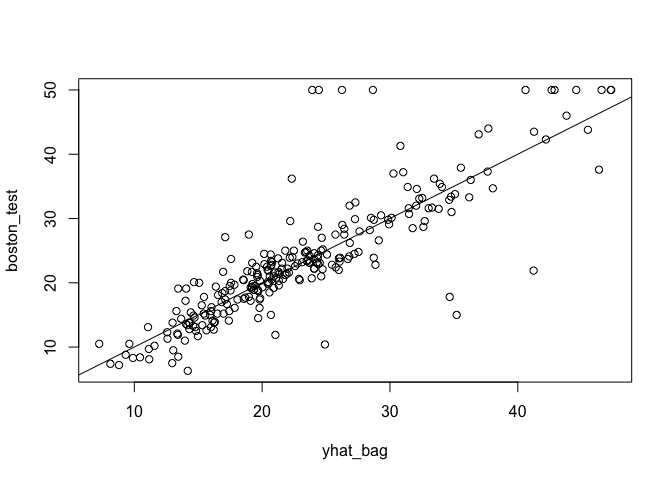

``` r
mean((yhat_bag - boston_test)^2)
```

    ## [1] 23.59273

So, bagging gives us an MSE of 23.6 as opposed to the decision tree regressor's value of 35.3. This is a considerable improvement!

Let's see the results now with a random forest. By default, it will use `m = p/3` for regression and *s**q**r**t*(*p*) for classification.

``` r
# random forest
set.seed(1)
rf_boston = randomForest(medv~., data=Boston, subset=train, importance=T)
yhat_rf = predict(rf_boston, newdata=Boston[-train, ])
mean((yhat_rf - boston_test)^2)
```

    ## [1] 18.11686

Even better!

``` r
# use importance() to see the importance of each variable
importance(rf_boston)
```

    ##           %IncMSE IncNodePurity
    ## crim    15.372334    1220.14856
    ## zn       3.335435     194.85945
    ## indus    6.964559    1021.94751
    ## chas     2.059298      69.68099
    ## nox     14.009761    1005.14707
    ## rm      28.693900    6162.30720
    ## age     13.832143     708.55138
    ## dis     10.317731     852.33701
    ## rad      4.390624     162.22597
    ## tax      7.536563     564.60422
    ## ptratio  9.333716    1163.39624
    ## black    8.341316     355.62445
    ## lstat   27.132450    5549.25088

This chart shows %IncMSE, which shows the average MSE increase if the corresponding predictor is excluded over all trees, and also the IncNodePurity, which is the average increase in node purity over all trees due to splits on the corresponding predictor. We can plot this chart like this.

``` r
varImpPlot(rf_boston)
```

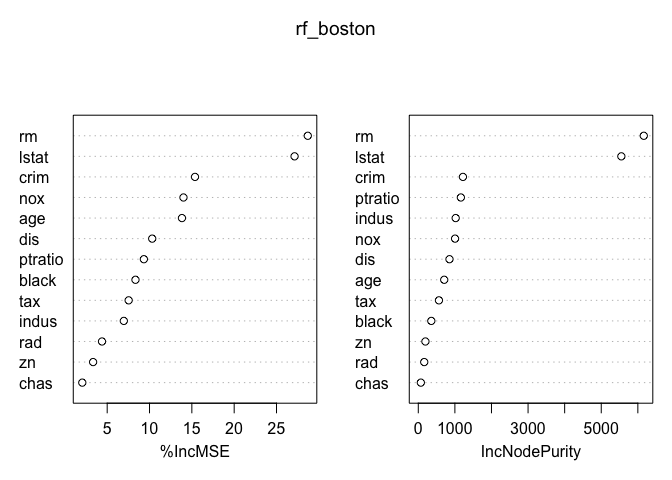

This might help us see that, for example, `rm` and `lstat` (lower status of the population) are far and away the most important predictors in this setting. `crim` looks to be in third place, but things become a little less clear as for the rest.

### Boosting with `Boston`

``` r
library(gbm)
```

    ## Loaded gbm 2.1.5

``` r
set.seed(1)

# Fit boosted regression tree 
boosted_boston = gbm(medv~., data=Boston[train,], distribution='gaussian', n.trees=5000, interaction.depth=4)  # set distribution to gaussian for regression problems
summary(boosted_boston)
```

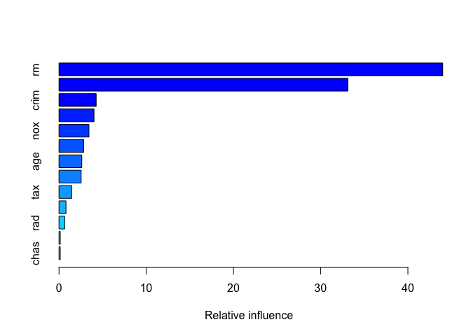

    ##             var    rel.inf
    ## rm           rm 43.9919329
    ## lstat     lstat 33.1216941
    ## crim       crim  4.2604167
    ## dis         dis  4.0111090
    ## nox         nox  3.4353017
    ## black     black  2.8267554
    ## age         age  2.6113938
    ## ptratio ptratio  2.5403035
    ## tax         tax  1.4565654
    ## indus     indus  0.8008740
    ## rad         rad  0.6546400
    ## zn           zn  0.1446149
    ## chas       chas  0.1443986

`summary()` gives us a relative influence chart and plot, which is cool! Again, we see that `rm` and `lstat` are by far the most important variables. We can make partial dependence plots for them, which show their effect after integrating out the other variables.

``` r
# partial dependence plots for rm and lstat
par(mfrow=c(1, 2))
plot(boosted_boston, i='rm')
```

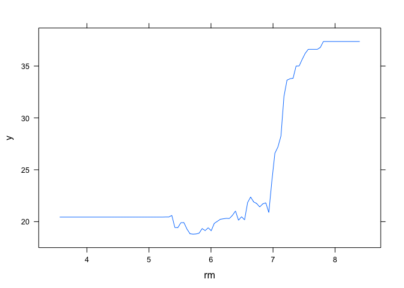

``` r
plot(boosted_boston, i='lstat')
```

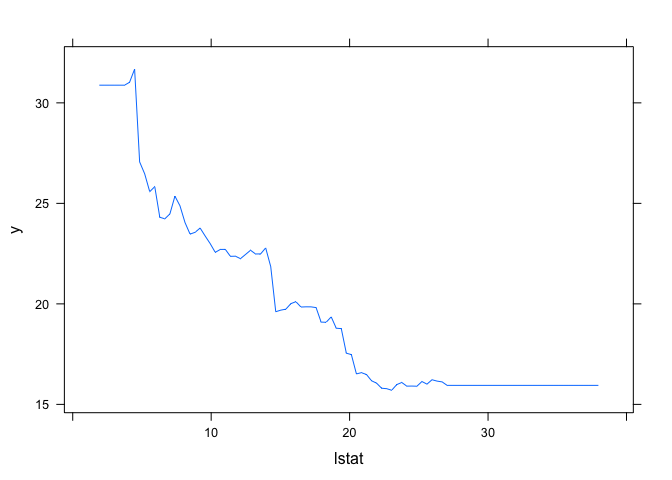

These plots follow our intuition that as `rm` increases, so does median house price, and as `lstat` increases, we get to a "lower status of the population", hence median house price decreases. This is nice to see visually.

``` r
# make predictions on test set
yhat_boost = predict(boosted_boston, newdata=Boston[-train, ], n.trees=5000)
mean((yhat_boost - boston_test)^2)
```

    ## [1] 18.84709

Our random forest gave us an MSE of 18.11, so this result is slightly higher but probably by a negligable amount.

This is it for tree-based methods. Some cool and different ideas here!
