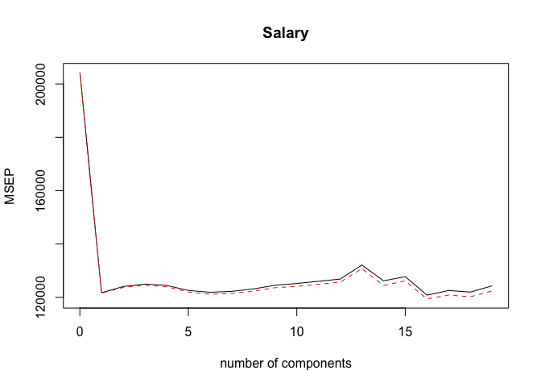
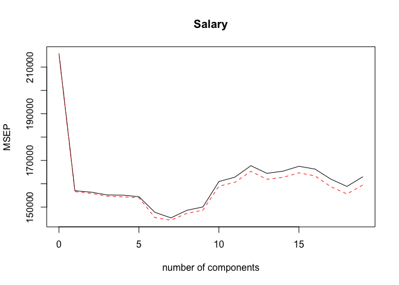
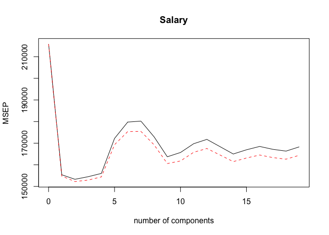

pcr\_and\_pls.Rmd
================

Lab 3: Principal Components and Partial Least Squares Regression
================================================================

### Principal Components Regression: again we will use the `Hitters` data set to predict `Salary`.

``` r
# load pls library, which contains the pcr() function, and ISLR library
library(pls)
```

    ## Warning: package 'pls' was built under R version 3.5.2

    ## 
    ## Attaching package: 'pls'

    ## The following object is masked from 'package:stats':
    ## 
    ##     loadings

``` r
library(ISLR)
set.seed(2)
# Remove missing vals
hitters = na.omit(Hitters)
```

``` r
# Fit pcr model
pcr_fit = pcr(Salary~., data=hitters, scale=T, validation='CV')  # scale=T standardizes each predictor, and validation='CV' employs 10-fold CV to choose M, the number of principal components
summary(pcr_fit)
```

    ## Data:    X dimension: 263 19 
    ##  Y dimension: 263 1
    ## Fit method: svdpc
    ## Number of components considered: 19
    ## 
    ## VALIDATION: RMSEP
    ## Cross-validated using 10 random segments.
    ##        (Intercept)  1 comps  2 comps  3 comps  4 comps  5 comps  6 comps
    ## CV             452    348.9    352.2    353.5    352.8    350.1    349.1
    ## adjCV          452    348.7    351.8    352.9    352.1    349.3    348.0
    ##        7 comps  8 comps  9 comps  10 comps  11 comps  12 comps  13 comps
    ## CV       349.6    350.9    352.9     353.8     355.0     356.2     363.5
    ## adjCV    348.5    349.8    351.6     352.3     353.4     354.5     361.6
    ##        14 comps  15 comps  16 comps  17 comps  18 comps  19 comps
    ## CV        355.2     357.4     347.6     350.1     349.2     352.6
    ## adjCV     352.8     355.2     345.5     347.6     346.7     349.8
    ## 
    ## TRAINING: % variance explained
    ##         1 comps  2 comps  3 comps  4 comps  5 comps  6 comps  7 comps
    ## X         38.31    60.16    70.84    79.03    84.29    88.63    92.26
    ## Salary    40.63    41.58    42.17    43.22    44.90    46.48    46.69
    ##         8 comps  9 comps  10 comps  11 comps  12 comps  13 comps  14 comps
    ## X         94.96    96.28     97.26     97.98     98.65     99.15     99.47
    ## Salary    46.75    46.86     47.76     47.82     47.85     48.10     50.40
    ##         15 comps  16 comps  17 comps  18 comps  19 comps
    ## X          99.75     99.89     99.97     99.99    100.00
    ## Salary     50.55     53.01     53.85     54.61     54.61

We note that the cross-validation scores given use the root mean square error, not the mean square error which we have been analyzing so far. We can just square these quantities to get the usual MSE.

We can also plot the CV scores:

``` r
validationplot(pcr_fit, val.type='MSEP')
```



``` r
min = which.min(summary(pcr_fit))
```

    ## Data:    X dimension: 263 19 
    ##  Y dimension: 263 1
    ## Fit method: svdpc
    ## Number of components considered: 19
    ## 
    ## VALIDATION: RMSEP
    ## Cross-validated using 10 random segments.
    ##        (Intercept)  1 comps  2 comps  3 comps  4 comps  5 comps  6 comps
    ## CV             452    348.9    352.2    353.5    352.8    350.1    349.1
    ## adjCV          452    348.7    351.8    352.9    352.1    349.3    348.0
    ##        7 comps  8 comps  9 comps  10 comps  11 comps  12 comps  13 comps
    ## CV       349.6    350.9    352.9     353.8     355.0     356.2     363.5
    ## adjCV    348.5    349.8    351.6     352.3     353.4     354.5     361.6
    ##        14 comps  15 comps  16 comps  17 comps  18 comps  19 comps
    ## CV        355.2     357.4     347.6     350.1     349.2     352.6
    ## adjCV     352.8     355.2     345.5     347.6     346.7     349.8
    ## 
    ## TRAINING: % variance explained
    ##         1 comps  2 comps  3 comps  4 comps  5 comps  6 comps  7 comps
    ## X         38.31    60.16    70.84    79.03    84.29    88.63    92.26
    ## Salary    40.63    41.58    42.17    43.22    44.90    46.48    46.69
    ##         8 comps  9 comps  10 comps  11 comps  12 comps  13 comps  14 comps
    ## X         94.96    96.28     97.26     97.98     98.65     99.15     99.47
    ## Salary    46.75    46.86     47.76     47.82     47.85     48.10     50.40
    ##         15 comps  16 comps  17 comps  18 comps  19 comps
    ## X          99.75     99.89     99.97     99.99    100.00
    ## Salary     50.55     53.01     53.85     54.61     54.61

On the y-axis we have MSE, and so we see it reaches a minimum at 16 components. This isn't much less than the MSE at 19 components, which corresponds to using OLS.

We also see that the `summary()` function tells us the % variance explained in the predictors and in the response, Salary. For example, using 2 principal components explains 60.16% of the variance in the predictors, while using 19 explains all (since all are included). An analogous interpretation goes for the numbers corresponding to Salary.

Now let's perform PCR on the training data and assess its performance on the test set.

``` r
# Make train and test
set.seed(1)
X = model.matrix(Salary~., data=hitters)[ , -1]  # drop intercept column
y = hitters$Salary
train = sample(1:nrow(X), nrow(X)/2)
test = -train

pcr_fit = pcr(Salary~., data=hitters, subset=train, scale=T, validation='CV')
validationplot(pcr_fit, val.type='MSEP')
```



Now, we see the minimum MSE comes with 7 components. Let's calculate the test MSE now for 7 components.

``` r
pcr_preds = predict(pcr_fit, X[test, ], ncomp=7)
mean((pcr_preds - y[test])^2)
```

    ## [1] 96556.22

This test MSE is similar to what we saw with ridge and lasso regularization. However, PCR is harder to interpret than something like lasso because it doesn't perform variable selection, nor does it directly give coefficient estimates. For this reason we might prefer those approaches.

Now we fit PCR on the whole data set, using 7 components.

``` r
pcr_fit = pcr(y~X, scale=T, ncomp=7)
summary(pcr_fit)
```

    ## Data:    X dimension: 263 19 
    ##  Y dimension: 263 1
    ## Fit method: svdpc
    ## Number of components considered: 7
    ## TRAINING: % variance explained
    ##    1 comps  2 comps  3 comps  4 comps  5 comps  6 comps  7 comps
    ## X    38.31    60.16    70.84    79.03    84.29    88.63    92.26
    ## y    40.63    41.58    42.17    43.22    44.90    46.48    46.69

### Partial Least Squares

``` r
# partial least squares on the training set uses the pls() function, also in the pls library
set.seed(1)
pls_fit = plsr(Salary~., data=hitters, subset=train, scale=T, validation='CV')
summary(pls_fit)
```

    ## Data:    X dimension: 131 19 
    ##  Y dimension: 131 1
    ## Fit method: kernelpls
    ## Number of components considered: 19
    ## 
    ## VALIDATION: RMSEP
    ## Cross-validated using 10 random segments.
    ##        (Intercept)  1 comps  2 comps  3 comps  4 comps  5 comps  6 comps
    ## CV           464.6    394.2    391.5    393.1    395.0    415.0    424.0
    ## adjCV        464.6    393.4    390.2    391.1    392.9    411.5    418.8
    ##        7 comps  8 comps  9 comps  10 comps  11 comps  12 comps  13 comps
    ## CV       424.5    415.8    404.6     407.1     412.0     414.4     410.3
    ## adjCV    418.9    411.4    400.7     402.2     407.2     409.3     405.6
    ##        14 comps  15 comps  16 comps  17 comps  18 comps  19 comps
    ## CV        406.2     408.6     410.5     408.8     407.8     410.2
    ## adjCV     401.8     403.9     405.6     404.1     403.2     405.5
    ## 
    ## TRAINING: % variance explained
    ##         1 comps  2 comps  3 comps  4 comps  5 comps  6 comps  7 comps
    ## X         38.12    53.46    66.05    74.49    79.33    84.56    87.09
    ## Salary    33.58    38.96    41.57    42.43    44.04    45.59    47.05
    ##         8 comps  9 comps  10 comps  11 comps  12 comps  13 comps  14 comps
    ## X         90.74    92.55     93.94     97.23     97.88     98.35     98.85
    ## Salary    47.53    48.42     49.68     50.04     50.54     50.78     50.92
    ##         15 comps  16 comps  17 comps  18 comps  19 comps
    ## X          99.11     99.43     99.78     99.99    100.00
    ## Salary     51.04     51.11     51.15     51.16     51.18

``` r
validationplot(pls_fit, val.type='MSEP')
```



We see that choosing *M* = 2 components gives the lowest CV MSE. Now let's calculate the test MSE for 2 components.

``` r
pls_preds = predict(pls_fit, X[test, ], ncomp=2)
mean((pls_preds - y[test])^2)
```

    ## [1] 101417.5

This test MSE is a bit higher than PCR, Lasso, and Ridge. Now we'll fit a pls model of 2 components to the whole data set.

``` r
pls_fit = plsr(y~X, scale=T, ncomp=2)
summary(pls_fit)
```

    ## Data:    X dimension: 263 19 
    ##  Y dimension: 263 1
    ## Fit method: kernelpls
    ## Number of components considered: 2
    ## TRAINING: % variance explained
    ##    1 comps  2 comps
    ## X    38.08    51.03
    ## y    43.05    46.40

It's important to note that the % variance explained in y for PLS with 2 components here is 46.40%, which is barely less than the 46.69% of the 7 component PCR regression we did early. This is because PLS seeks for directions, or linear combinations, that maximize variance explained in both the predictors and the response, while PCR only seeks those that maximize variance in the predictors.
