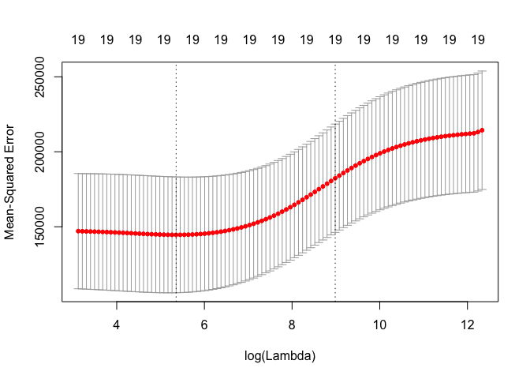
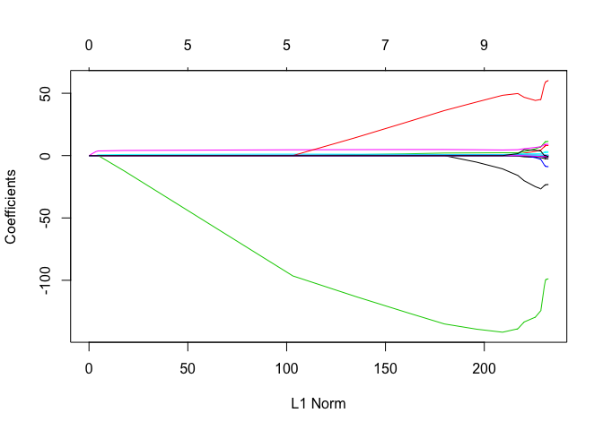
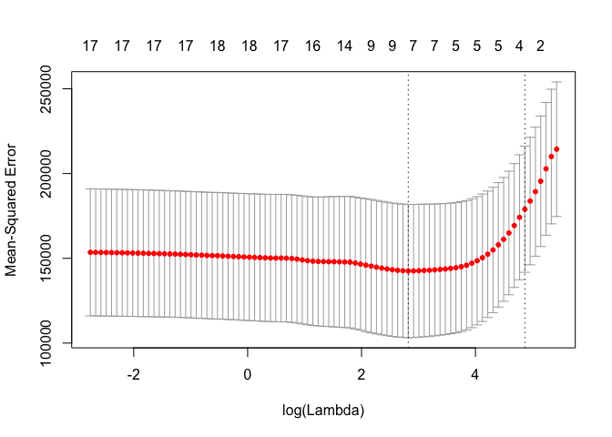

ridge\_regression\_and\_the\_lasso.Rmd
================

Lab 2: Ridge Regression and the Lasso
=====================================

### Ridge Regression: predicting Salary based on variables in the `Hitters` data set.

``` r
library(ISLR)
hitters = na.omit(Hitters)
names(hitters)
```

    ##  [1] "AtBat"     "Hits"      "HmRun"     "Runs"      "RBI"      
    ##  [6] "Walks"     "Years"     "CAtBat"    "CHits"     "CHmRun"   
    ## [11] "CRuns"     "CRBI"      "CWalks"    "League"    "Division" 
    ## [16] "PutOuts"   "Assists"   "Errors"    "Salary"    "NewLeague"

``` r
# Split data into X and y, this function converts categorical vars to dummy vars
X = model.matrix(Salary~., data=hitters)[ , -1]  # drop intercept column
y = hitters$Salary

# perform ridge regression with glmnet() function, setting alpha=0. alpha=1 performs lasso
library(glmnet)
```

    ## Warning: package 'glmnet' was built under R version 3.5.2

    ## Loading required package: Matrix

    ## Loading required package: foreach

    ## Loaded glmnet 2.0-18

``` r
grid = 10^seq(10, -2, length=100)  # grid of potential lambda values
ridge_mod = glmnet(X, y, alpha=0, lambda=grid)
dim(coef(ridge_mod))  # A matrix for which the rows are predictors, and the columns are values of lambda. The entries are the corresponding coefficient estimates
```

    ## [1]  20 100

When using ridge regression, we expect higher values of lambda to result in lower coefficient estimates and therefore also a lower l2 norm. Let's check that now.

``` r
ridge_mod$lambda[60]
```

    ## [1] 705.4802

``` r
coef(ridge_mod)[, 60]
```

    ##  (Intercept)        AtBat         Hits        HmRun         Runs 
    ##  54.32519950   0.11211115   0.65622409   1.17980910   0.93769713 
    ##          RBI        Walks        Years       CAtBat        CHits 
    ##   0.84718546   1.31987948   2.59640425   0.01083413   0.04674557 
    ##       CHmRun        CRuns         CRBI       CWalks      LeagueN 
    ##   0.33777318   0.09355528   0.09780402   0.07189612  13.68370191 
    ##    DivisionW      PutOuts      Assists       Errors   NewLeagueN 
    ## -54.65877750   0.11852289   0.01606037  -0.70358655   8.61181213

``` r
sqrt(sum(coef(ridge_mod)[-1, 60]^2))  # l2 norm
```

    ## [1] 57.11001

``` r
ridge_mod$lambda[2]
```

    ## [1] 7564633276

``` r
coef(ridge_mod)[, 2]
```

    ##   (Intercept)         AtBat          Hits         HmRun          Runs 
    ##  5.359256e+02  7.195940e-08  2.610289e-07  1.051805e-06  4.414196e-07 
    ##           RBI         Walks         Years        CAtBat         CHits 
    ##  4.662778e-07  5.487803e-07  2.244274e-06  6.178412e-09  2.273832e-08 
    ##        CHmRun         CRuns          CRBI        CWalks       LeagueN 
    ##  1.714783e-07  4.561814e-08  4.707892e-08  4.980911e-08 -7.667601e-07 
    ##     DivisionW       PutOuts       Assists        Errors    NewLeagueN 
    ## -1.032074e-05  2.882212e-08  4.707694e-09 -2.195031e-08 -1.523253e-07

``` r
sqrt(sum(coef(ridge_mod)[-1, 2]^2))  # l2 norm
```

    ## [1] 1.068161e-05

Here, we compare a lambda of 705 to a lambda of over 7 billion. The latter, as we can see, results in coefficients that are basically all close to 0, with a small l2 norm. With 705, we see that opposite. So, our intuition checks out.

``` r
# let's use predict() in order to choose a specific value of lambda
predict(ridge_mod, s=50, type='coefficients')[1:20, ]
```

    ##   (Intercept)         AtBat          Hits         HmRun          Runs 
    ##  4.876610e+01 -3.580999e-01  1.969359e+00 -1.278248e+00  1.145892e+00 
    ##           RBI         Walks         Years        CAtBat         CHits 
    ##  8.038292e-01  2.716186e+00 -6.218319e+00  5.447837e-03  1.064895e-01 
    ##        CHmRun         CRuns          CRBI        CWalks       LeagueN 
    ##  6.244860e-01  2.214985e-01  2.186914e-01 -1.500245e-01  4.592589e+01 
    ##     DivisionW       PutOuts       Assists        Errors    NewLeagueN 
    ## -1.182011e+02  2.502322e-01  1.215665e-01 -3.278600e+00 -9.496680e+00

These coefficients, relative to the ones above, are much bigger because of the smaller value of lambda, which makes sense.

``` r
# Split data into train and test to be able to estimate test error
set.seed(1)
# Generate indices for training data
train = sample(1:nrow(X), nrow(X)/2)
test = -train
y_test = y[test]

# Model and predict
ridge_mod = glmnet(X[train, ], y[train], alpha=0, lambda=grid, thresh=1e-12)
ridge_preds = predict(ridge_mod, s=4, newx=X[test, ])  # setting lambda=4 like the book
mean((y_test - ridge_preds)^2)
```

    ## [1] 101036.8

Does this give us an advantage over OLS? Let's see.

``` r
ridge_preds = predict(ridge_mod, s=0, newx=X[test, ], exact=T, x=X[train, ], y=y[train])  # setting lambda=0 and exact=T to achieve OLS
mean((y_test - ridge_preds)^2)
```

    ## [1] 114783.1

(We could have just used the `lm()` function to do this, and would've seen useful results too, like p-values and R-sq, but doing it this way is useful to know in this context.)

Now, instead of just randomly choosing lambda = 4, we'll choose it using cross-validation, specifically the `cv.glmnet()` function that performs 10-fold CV by default.

``` r
set.seed(1)
cv_out = cv.glmnet(X[train, ], y[train], alpha=0)
plot(cv_out)
```



``` r
best_lam = cv_out$lambda.min
best_lam
```

    ## [1] 211.7416

Hence the best value for lambda here is about 212. Let's check its corresponding MSE.

``` r
# MSE for lambda=212
ridge_preds = predict(ridge_mod, s=best_lam, newx=X[test, ])
mean((y_test - ridge_preds)^2)
```

    ## [1] 96015.51

This is the lowest MSE we've seen so far and therefore our best model! Now, as usual, we'll fit this model to the entire data set to achieve stable coefficient estimates.

``` r
final_ridge = glmnet(X, y, alpha=0)
predict(final_ridge, type='coefficients', s=best_lam)[1:20, ]  # examine coeffs
```

    ##  (Intercept)        AtBat         Hits        HmRun         Runs 
    ##   9.88487157   0.03143991   1.00882875   0.13927624   1.11320781 
    ##          RBI        Walks        Years       CAtBat        CHits 
    ##   0.87318990   1.80410229   0.13074383   0.01113978   0.06489843 
    ##       CHmRun        CRuns         CRBI       CWalks      LeagueN 
    ##   0.45158546   0.12900049   0.13737712   0.02908572  27.18227527 
    ##    DivisionW      PutOuts      Assists       Errors   NewLeagueN 
    ## -91.63411282   0.19149252   0.04254536  -1.81244470   7.21208394

These coefficients are those of our final and best ridge model!

### The Lasso: do we get better results in this setting?

``` r
# train and plot lasso
lasso_mod = glmnet(X[train, ], y[train], alpha=1, lambda=grid)
plot(lasso_mod)
```



In this plot, we see that as the L1 Norm increases, which corresponds to decreasing lambda, at different moments some coefficients become non-zero. In other words, for certain choices of lambda, the lasso is zeroing out certain predictors!

As with ridge regression, let's perform cross-validation to find the best value for lambda.

``` r
set.seed(1)
cv_lasso = cv.glmnet(X[train, ], y[train], alpha=1)
plot(cv_lasso)
```



``` r
best_lam = cv_lasso$lambda.min
best_lam
```

    ## [1] 16.78016

The best lambda value here is about 17. Let's see what we get when we calculate the model's MSE with this value of lambda.

``` r
# MSE for lambda=17
lasso_preds = predict(lasso_mod, s=best_lam, newx=X[test, ])
mean((y_test - lasso_preds)^2)
```

    ## [1] 100743.4

This test MSE is better than the OLS result, and just slightly more than the ridge result. Because it is only just a little bit higher than the ridge test MSE, we might prefer this lasso model because it encourages sparser models. We can see that below by looking at its coefficients.

``` r
final_lasso = glmnet(X, y, alpha=1)
predict(final_lasso, type='coefficients', s=best_lam)[1:20, ]  # examine coeffs
```

    ##  (Intercept)        AtBat         Hits        HmRun         Runs 
    ##   19.5223995    0.0000000    1.8701714    0.0000000    0.0000000 
    ##          RBI        Walks        Years       CAtBat        CHits 
    ##    0.0000000    2.2187934    0.0000000    0.0000000    0.0000000 
    ##       CHmRun        CRuns         CRBI       CWalks      LeagueN 
    ##    0.0000000    0.2072852    0.4127984    0.0000000    1.7591970 
    ##    DivisionW      PutOuts      Assists       Errors   NewLeagueN 
    ## -103.5051402    0.2206884    0.0000000    0.0000000    0.0000000

And so, the lasso has zeroed out 12/19 variables. Because it has created a simpler model than the ridge model, we might prefer it despite its slightly greater test MSE. For example, if inference is something we value, we'd probably prefer this lasso model. But, if we want sheer prediction accuracy, the ridge model might be better.

Above all, this example and comparison shows some of the cool decisions you might have to make as a data scientist regarding model selection!
