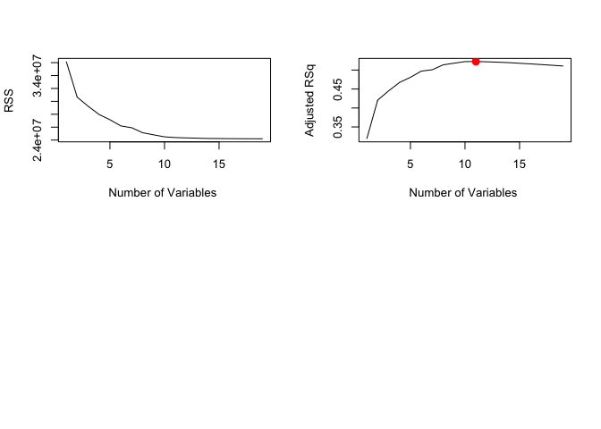
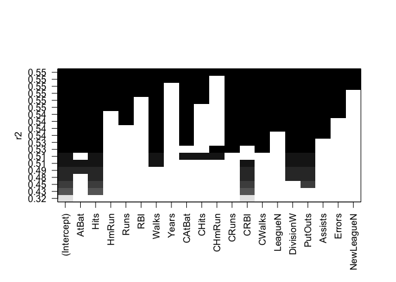
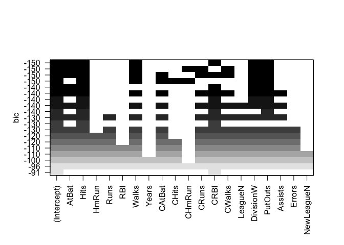
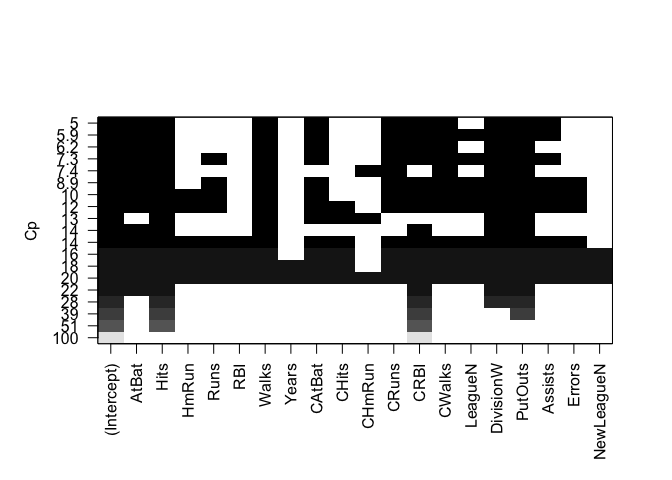
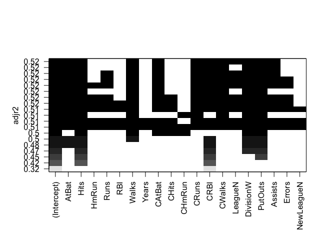
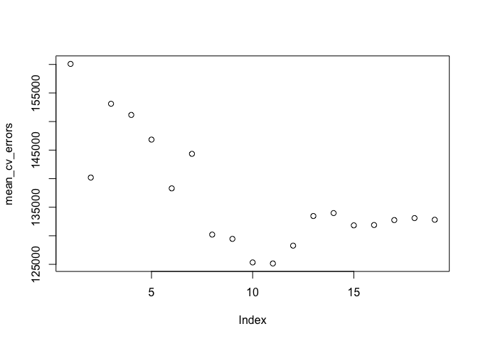

linear\_model\_selection
================

Lab 1: Subset Selection Methods
===============================

### Best Subset Selection: We use the `Hitters` data set to predict `Salary` based on the previous year's statistics.

``` r
library(ISLR)
names(Hitters)
```

    ##  [1] "AtBat"     "Hits"      "HmRun"     "Runs"      "RBI"      
    ##  [6] "Walks"     "Years"     "CAtBat"    "CHits"     "CHmRun"   
    ## [11] "CRuns"     "CRBI"      "CWalks"    "League"    "Division" 
    ## [16] "PutOuts"   "Assists"   "Errors"    "Salary"    "NewLeague"

``` r
head(Hitters)  # We see sone missing values in the response column...
```

    ##                   AtBat Hits HmRun Runs RBI Walks Years CAtBat CHits
    ## -Andy Allanson      293   66     1   30  29    14     1    293    66
    ## -Alan Ashby         315   81     7   24  38    39    14   3449   835
    ## -Alvin Davis        479  130    18   66  72    76     3   1624   457
    ## -Andre Dawson       496  141    20   65  78    37    11   5628  1575
    ## -Andres Galarraga   321   87    10   39  42    30     2    396   101
    ## -Alfredo Griffin    594  169     4   74  51    35    11   4408  1133
    ##                   CHmRun CRuns CRBI CWalks League Division PutOuts Assists
    ## -Andy Allanson         1    30   29     14      A        E     446      33
    ## -Alan Ashby           69   321  414    375      N        W     632      43
    ## -Alvin Davis          63   224  266    263      A        W     880      82
    ## -Andre Dawson        225   828  838    354      N        E     200      11
    ## -Andres Galarraga     12    48   46     33      N        E     805      40
    ## -Alfredo Griffin      19   501  336    194      A        W     282     421
    ##                   Errors Salary NewLeague
    ## -Andy Allanson        20     NA         A
    ## -Alan Ashby           10  475.0         N
    ## -Alvin Davis          14  480.0         A
    ## -Andre Dawson          3  500.0         N
    ## -Andres Galarraga      4   91.5         N
    ## -Alfredo Griffin      25  750.0         A

``` r
# Calculate # of NAs in Salary
sum(is.na(Hitters$Salary))
```

    ## [1] 59

To address this problem, we'll drop rows with missing values.

``` r
hitters = na.omit(Hitters)
nrow(Hitters) - nrow(hitters)  # Kind of interestingly, all rows with missing values had missing values in Salary
```

    ## [1] 59

``` r
# Now we perform best subset selection using the regsubsets() function of the leaps library
library(leaps)
regfit_full = regsubsets(Salary~., data=hitters)
summary(regfit_full)
```

    ## Subset selection object
    ## Call: regsubsets.formula(Salary ~ ., data = hitters)
    ## 19 Variables  (and intercept)
    ##            Forced in Forced out
    ## AtBat          FALSE      FALSE
    ## Hits           FALSE      FALSE
    ## HmRun          FALSE      FALSE
    ## Runs           FALSE      FALSE
    ## RBI            FALSE      FALSE
    ## Walks          FALSE      FALSE
    ## Years          FALSE      FALSE
    ## CAtBat         FALSE      FALSE
    ## CHits          FALSE      FALSE
    ## CHmRun         FALSE      FALSE
    ## CRuns          FALSE      FALSE
    ## CRBI           FALSE      FALSE
    ## CWalks         FALSE      FALSE
    ## LeagueN        FALSE      FALSE
    ## DivisionW      FALSE      FALSE
    ## PutOuts        FALSE      FALSE
    ## Assists        FALSE      FALSE
    ## Errors         FALSE      FALSE
    ## NewLeagueN     FALSE      FALSE
    ## 1 subsets of each size up to 8
    ## Selection Algorithm: exhaustive
    ##          AtBat Hits HmRun Runs RBI Walks Years CAtBat CHits CHmRun CRuns
    ## 1  ( 1 ) " "   " "  " "   " "  " " " "   " "   " "    " "   " "    " "  
    ## 2  ( 1 ) " "   "*"  " "   " "  " " " "   " "   " "    " "   " "    " "  
    ## 3  ( 1 ) " "   "*"  " "   " "  " " " "   " "   " "    " "   " "    " "  
    ## 4  ( 1 ) " "   "*"  " "   " "  " " " "   " "   " "    " "   " "    " "  
    ## 5  ( 1 ) "*"   "*"  " "   " "  " " " "   " "   " "    " "   " "    " "  
    ## 6  ( 1 ) "*"   "*"  " "   " "  " " "*"   " "   " "    " "   " "    " "  
    ## 7  ( 1 ) " "   "*"  " "   " "  " " "*"   " "   "*"    "*"   "*"    " "  
    ## 8  ( 1 ) "*"   "*"  " "   " "  " " "*"   " "   " "    " "   "*"    "*"  
    ##          CRBI CWalks LeagueN DivisionW PutOuts Assists Errors NewLeagueN
    ## 1  ( 1 ) "*"  " "    " "     " "       " "     " "     " "    " "       
    ## 2  ( 1 ) "*"  " "    " "     " "       " "     " "     " "    " "       
    ## 3  ( 1 ) "*"  " "    " "     " "       "*"     " "     " "    " "       
    ## 4  ( 1 ) "*"  " "    " "     "*"       "*"     " "     " "    " "       
    ## 5  ( 1 ) "*"  " "    " "     "*"       "*"     " "     " "    " "       
    ## 6  ( 1 ) "*"  " "    " "     "*"       "*"     " "     " "    " "       
    ## 7  ( 1 ) " "  " "    " "     "*"       "*"     " "     " "    " "       
    ## 8  ( 1 ) " "  "*"    " "     "*"       "*"     " "     " "    " "

The asterisks indicate which variables are included in which model. And the function `regsubsets()` will only report up to 8 variables. If we use `nvmax()`, we can include more:

``` r
regfit_full_max = regsubsets(Salary~., data=hitters, nvmax=19)
summary(regfit_full_max)
```

    ## Subset selection object
    ## Call: regsubsets.formula(Salary ~ ., data = hitters, nvmax = 19)
    ## 19 Variables  (and intercept)
    ##            Forced in Forced out
    ## AtBat          FALSE      FALSE
    ## Hits           FALSE      FALSE
    ## HmRun          FALSE      FALSE
    ## Runs           FALSE      FALSE
    ## RBI            FALSE      FALSE
    ## Walks          FALSE      FALSE
    ## Years          FALSE      FALSE
    ## CAtBat         FALSE      FALSE
    ## CHits          FALSE      FALSE
    ## CHmRun         FALSE      FALSE
    ## CRuns          FALSE      FALSE
    ## CRBI           FALSE      FALSE
    ## CWalks         FALSE      FALSE
    ## LeagueN        FALSE      FALSE
    ## DivisionW      FALSE      FALSE
    ## PutOuts        FALSE      FALSE
    ## Assists        FALSE      FALSE
    ## Errors         FALSE      FALSE
    ## NewLeagueN     FALSE      FALSE
    ## 1 subsets of each size up to 19
    ## Selection Algorithm: exhaustive
    ##           AtBat Hits HmRun Runs RBI Walks Years CAtBat CHits CHmRun CRuns
    ## 1  ( 1 )  " "   " "  " "   " "  " " " "   " "   " "    " "   " "    " "  
    ## 2  ( 1 )  " "   "*"  " "   " "  " " " "   " "   " "    " "   " "    " "  
    ## 3  ( 1 )  " "   "*"  " "   " "  " " " "   " "   " "    " "   " "    " "  
    ## 4  ( 1 )  " "   "*"  " "   " "  " " " "   " "   " "    " "   " "    " "  
    ## 5  ( 1 )  "*"   "*"  " "   " "  " " " "   " "   " "    " "   " "    " "  
    ## 6  ( 1 )  "*"   "*"  " "   " "  " " "*"   " "   " "    " "   " "    " "  
    ## 7  ( 1 )  " "   "*"  " "   " "  " " "*"   " "   "*"    "*"   "*"    " "  
    ## 8  ( 1 )  "*"   "*"  " "   " "  " " "*"   " "   " "    " "   "*"    "*"  
    ## 9  ( 1 )  "*"   "*"  " "   " "  " " "*"   " "   "*"    " "   " "    "*"  
    ## 10  ( 1 ) "*"   "*"  " "   " "  " " "*"   " "   "*"    " "   " "    "*"  
    ## 11  ( 1 ) "*"   "*"  " "   " "  " " "*"   " "   "*"    " "   " "    "*"  
    ## 12  ( 1 ) "*"   "*"  " "   "*"  " " "*"   " "   "*"    " "   " "    "*"  
    ## 13  ( 1 ) "*"   "*"  " "   "*"  " " "*"   " "   "*"    " "   " "    "*"  
    ## 14  ( 1 ) "*"   "*"  "*"   "*"  " " "*"   " "   "*"    " "   " "    "*"  
    ## 15  ( 1 ) "*"   "*"  "*"   "*"  " " "*"   " "   "*"    "*"   " "    "*"  
    ## 16  ( 1 ) "*"   "*"  "*"   "*"  "*" "*"   " "   "*"    "*"   " "    "*"  
    ## 17  ( 1 ) "*"   "*"  "*"   "*"  "*" "*"   " "   "*"    "*"   " "    "*"  
    ## 18  ( 1 ) "*"   "*"  "*"   "*"  "*" "*"   "*"   "*"    "*"   " "    "*"  
    ## 19  ( 1 ) "*"   "*"  "*"   "*"  "*" "*"   "*"   "*"    "*"   "*"    "*"  
    ##           CRBI CWalks LeagueN DivisionW PutOuts Assists Errors NewLeagueN
    ## 1  ( 1 )  "*"  " "    " "     " "       " "     " "     " "    " "       
    ## 2  ( 1 )  "*"  " "    " "     " "       " "     " "     " "    " "       
    ## 3  ( 1 )  "*"  " "    " "     " "       "*"     " "     " "    " "       
    ## 4  ( 1 )  "*"  " "    " "     "*"       "*"     " "     " "    " "       
    ## 5  ( 1 )  "*"  " "    " "     "*"       "*"     " "     " "    " "       
    ## 6  ( 1 )  "*"  " "    " "     "*"       "*"     " "     " "    " "       
    ## 7  ( 1 )  " "  " "    " "     "*"       "*"     " "     " "    " "       
    ## 8  ( 1 )  " "  "*"    " "     "*"       "*"     " "     " "    " "       
    ## 9  ( 1 )  "*"  "*"    " "     "*"       "*"     " "     " "    " "       
    ## 10  ( 1 ) "*"  "*"    " "     "*"       "*"     "*"     " "    " "       
    ## 11  ( 1 ) "*"  "*"    "*"     "*"       "*"     "*"     " "    " "       
    ## 12  ( 1 ) "*"  "*"    "*"     "*"       "*"     "*"     " "    " "       
    ## 13  ( 1 ) "*"  "*"    "*"     "*"       "*"     "*"     "*"    " "       
    ## 14  ( 1 ) "*"  "*"    "*"     "*"       "*"     "*"     "*"    " "       
    ## 15  ( 1 ) "*"  "*"    "*"     "*"       "*"     "*"     "*"    " "       
    ## 16  ( 1 ) "*"  "*"    "*"     "*"       "*"     "*"     "*"    " "       
    ## 17  ( 1 ) "*"  "*"    "*"     "*"       "*"     "*"     "*"    "*"       
    ## 18  ( 1 ) "*"  "*"    "*"     "*"       "*"     "*"     "*"    "*"       
    ## 19  ( 1 ) "*"  "*"    "*"     "*"       "*"     "*"     "*"    "*"

This is the result if we consider subsets of size 19 using the `nvmax` paramater. So, since we have 19 models, the question becomes which one is best. We can look at statistics like the adjsusted-R-squared value and more to decide.

``` r
# statistics that will help us decide 
names(summary(regfit_full_max))
```

    ## [1] "which"  "rsq"    "rss"    "adjr2"  "cp"     "bic"    "outmat" "obj"

``` r
summary(regfit_full_max)$rsq  # R-squared value
```

    ##  [1] 0.3214501 0.4252237 0.4514294 0.4754067 0.4908036 0.5087146 0.5141227
    ##  [8] 0.5285569 0.5346124 0.5404950 0.5426153 0.5436302 0.5444570 0.5452164
    ## [15] 0.5454692 0.5457656 0.5459518 0.5460945 0.5461159

The R-squard values increase as we use more variables, as expected.

``` r
# Let's plot the RSS, adjusted-R-squared, C_p, and BIC to help us decide which model to use.
par(mfrow=c(2, 2))

plot(summary(regfit_full_max)$rss ,xlab="Number of Variables ",ylab="RSS",
type="l")

plot(summary(regfit_full_max)$adjr2 ,xlab="Number of Variables ",
ylab="Adjusted RSq",type="l")

which.max(summary(regfit_full_max)$adjr2)
```

    ## [1] 11

``` r
points(11, summary(regfit_full_max)$adjr2[11], col="red", cex=2,pch=20)
```



And so we see that the adjusted-R-squared value achieves its max at 11 variables. Let's do the same for the *C*<sub>*p*</sub> and *B**I**C* statistics, for which we want the min.

``` r
par(mfrow=c(2, 2))
plot(summary(regfit_full_max)$cp, xlab="Number of Variables ",ylab="Cp",
type="l")
min1 = which.min(summary(regfit_full_max)$cp)
points(min1, summary(regfit_full_max)$cp[min1], col="red", cex=2,pch=20)

plot(summary(regfit_full_max)$bic, xlab="Number of Variables ",ylab="BIC",
type="l")
min2 = which.min(summary(regfit_full_max)$bic)
points(min2, summary(regfit_full_max)$bic[min2], col="red", cex=2,pch=20)
```


So, *C*<sub>*p*</sub> achieves its min at 10 variables, and *B**I**C* at 6.

``` r
# Use regsubsets built-in plot function to examine variables
plot(regfit_full_max, scale="r2")
```



``` r
plot(regfit_full_max, scale="bic")
```



``` r
plot(regfit_full_max, scale="Cp")
```



``` r
plot(regfit_full_max, scale="adjr2")
```



In these plots plot, each row is a model. The variable is included if its square is black. In the *B**I**C* plot, there are several models that show -150 BIC. However, the top row will be the lowest, and includes the 6 variables AtBat, Hits, Walks, CRBI, DivisionW, and PutOuts (and the intercept of course).

``` r
# Show coefficients
coef(regfit_full_max, 6)
```

    ##  (Intercept)        AtBat         Hits        Walks         CRBI 
    ##   91.5117981   -1.8685892    7.6043976    3.6976468    0.6430169 
    ##    DivisionW      PutOuts 
    ## -122.9515338    0.2643076

### Forward and Backward Stepwise Selection

``` r
# Forward and backward selection
regfit_fwd = regsubsets(Salary~., data=hitters, nvmax=19, method='forward')
summary(regfit_fwd)
```

    ## Subset selection object
    ## Call: regsubsets.formula(Salary ~ ., data = hitters, nvmax = 19, method = "forward")
    ## 19 Variables  (and intercept)
    ##            Forced in Forced out
    ## AtBat          FALSE      FALSE
    ## Hits           FALSE      FALSE
    ## HmRun          FALSE      FALSE
    ## Runs           FALSE      FALSE
    ## RBI            FALSE      FALSE
    ## Walks          FALSE      FALSE
    ## Years          FALSE      FALSE
    ## CAtBat         FALSE      FALSE
    ## CHits          FALSE      FALSE
    ## CHmRun         FALSE      FALSE
    ## CRuns          FALSE      FALSE
    ## CRBI           FALSE      FALSE
    ## CWalks         FALSE      FALSE
    ## LeagueN        FALSE      FALSE
    ## DivisionW      FALSE      FALSE
    ## PutOuts        FALSE      FALSE
    ## Assists        FALSE      FALSE
    ## Errors         FALSE      FALSE
    ## NewLeagueN     FALSE      FALSE
    ## 1 subsets of each size up to 19
    ## Selection Algorithm: forward
    ##           AtBat Hits HmRun Runs RBI Walks Years CAtBat CHits CHmRun CRuns
    ## 1  ( 1 )  " "   " "  " "   " "  " " " "   " "   " "    " "   " "    " "  
    ## 2  ( 1 )  " "   "*"  " "   " "  " " " "   " "   " "    " "   " "    " "  
    ## 3  ( 1 )  " "   "*"  " "   " "  " " " "   " "   " "    " "   " "    " "  
    ## 4  ( 1 )  " "   "*"  " "   " "  " " " "   " "   " "    " "   " "    " "  
    ## 5  ( 1 )  "*"   "*"  " "   " "  " " " "   " "   " "    " "   " "    " "  
    ## 6  ( 1 )  "*"   "*"  " "   " "  " " "*"   " "   " "    " "   " "    " "  
    ## 7  ( 1 )  "*"   "*"  " "   " "  " " "*"   " "   " "    " "   " "    " "  
    ## 8  ( 1 )  "*"   "*"  " "   " "  " " "*"   " "   " "    " "   " "    "*"  
    ## 9  ( 1 )  "*"   "*"  " "   " "  " " "*"   " "   "*"    " "   " "    "*"  
    ## 10  ( 1 ) "*"   "*"  " "   " "  " " "*"   " "   "*"    " "   " "    "*"  
    ## 11  ( 1 ) "*"   "*"  " "   " "  " " "*"   " "   "*"    " "   " "    "*"  
    ## 12  ( 1 ) "*"   "*"  " "   "*"  " " "*"   " "   "*"    " "   " "    "*"  
    ## 13  ( 1 ) "*"   "*"  " "   "*"  " " "*"   " "   "*"    " "   " "    "*"  
    ## 14  ( 1 ) "*"   "*"  "*"   "*"  " " "*"   " "   "*"    " "   " "    "*"  
    ## 15  ( 1 ) "*"   "*"  "*"   "*"  " " "*"   " "   "*"    "*"   " "    "*"  
    ## 16  ( 1 ) "*"   "*"  "*"   "*"  "*" "*"   " "   "*"    "*"   " "    "*"  
    ## 17  ( 1 ) "*"   "*"  "*"   "*"  "*" "*"   " "   "*"    "*"   " "    "*"  
    ## 18  ( 1 ) "*"   "*"  "*"   "*"  "*" "*"   "*"   "*"    "*"   " "    "*"  
    ## 19  ( 1 ) "*"   "*"  "*"   "*"  "*" "*"   "*"   "*"    "*"   "*"    "*"  
    ##           CRBI CWalks LeagueN DivisionW PutOuts Assists Errors NewLeagueN
    ## 1  ( 1 )  "*"  " "    " "     " "       " "     " "     " "    " "       
    ## 2  ( 1 )  "*"  " "    " "     " "       " "     " "     " "    " "       
    ## 3  ( 1 )  "*"  " "    " "     " "       "*"     " "     " "    " "       
    ## 4  ( 1 )  "*"  " "    " "     "*"       "*"     " "     " "    " "       
    ## 5  ( 1 )  "*"  " "    " "     "*"       "*"     " "     " "    " "       
    ## 6  ( 1 )  "*"  " "    " "     "*"       "*"     " "     " "    " "       
    ## 7  ( 1 )  "*"  "*"    " "     "*"       "*"     " "     " "    " "       
    ## 8  ( 1 )  "*"  "*"    " "     "*"       "*"     " "     " "    " "       
    ## 9  ( 1 )  "*"  "*"    " "     "*"       "*"     " "     " "    " "       
    ## 10  ( 1 ) "*"  "*"    " "     "*"       "*"     "*"     " "    " "       
    ## 11  ( 1 ) "*"  "*"    "*"     "*"       "*"     "*"     " "    " "       
    ## 12  ( 1 ) "*"  "*"    "*"     "*"       "*"     "*"     " "    " "       
    ## 13  ( 1 ) "*"  "*"    "*"     "*"       "*"     "*"     "*"    " "       
    ## 14  ( 1 ) "*"  "*"    "*"     "*"       "*"     "*"     "*"    " "       
    ## 15  ( 1 ) "*"  "*"    "*"     "*"       "*"     "*"     "*"    " "       
    ## 16  ( 1 ) "*"  "*"    "*"     "*"       "*"     "*"     "*"    " "       
    ## 17  ( 1 ) "*"  "*"    "*"     "*"       "*"     "*"     "*"    "*"       
    ## 18  ( 1 ) "*"  "*"    "*"     "*"       "*"     "*"     "*"    "*"       
    ## 19  ( 1 ) "*"  "*"    "*"     "*"       "*"     "*"     "*"    "*"

``` r
regfit_bwd = regsubsets(Salary~., data=hitters, nvmax=19, method='backward')
summary(regfit_bwd)
```

    ## Subset selection object
    ## Call: regsubsets.formula(Salary ~ ., data = hitters, nvmax = 19, method = "backward")
    ## 19 Variables  (and intercept)
    ##            Forced in Forced out
    ## AtBat          FALSE      FALSE
    ## Hits           FALSE      FALSE
    ## HmRun          FALSE      FALSE
    ## Runs           FALSE      FALSE
    ## RBI            FALSE      FALSE
    ## Walks          FALSE      FALSE
    ## Years          FALSE      FALSE
    ## CAtBat         FALSE      FALSE
    ## CHits          FALSE      FALSE
    ## CHmRun         FALSE      FALSE
    ## CRuns          FALSE      FALSE
    ## CRBI           FALSE      FALSE
    ## CWalks         FALSE      FALSE
    ## LeagueN        FALSE      FALSE
    ## DivisionW      FALSE      FALSE
    ## PutOuts        FALSE      FALSE
    ## Assists        FALSE      FALSE
    ## Errors         FALSE      FALSE
    ## NewLeagueN     FALSE      FALSE
    ## 1 subsets of each size up to 19
    ## Selection Algorithm: backward
    ##           AtBat Hits HmRun Runs RBI Walks Years CAtBat CHits CHmRun CRuns
    ## 1  ( 1 )  " "   " "  " "   " "  " " " "   " "   " "    " "   " "    "*"  
    ## 2  ( 1 )  " "   "*"  " "   " "  " " " "   " "   " "    " "   " "    "*"  
    ## 3  ( 1 )  " "   "*"  " "   " "  " " " "   " "   " "    " "   " "    "*"  
    ## 4  ( 1 )  "*"   "*"  " "   " "  " " " "   " "   " "    " "   " "    "*"  
    ## 5  ( 1 )  "*"   "*"  " "   " "  " " "*"   " "   " "    " "   " "    "*"  
    ## 6  ( 1 )  "*"   "*"  " "   " "  " " "*"   " "   " "    " "   " "    "*"  
    ## 7  ( 1 )  "*"   "*"  " "   " "  " " "*"   " "   " "    " "   " "    "*"  
    ## 8  ( 1 )  "*"   "*"  " "   " "  " " "*"   " "   " "    " "   " "    "*"  
    ## 9  ( 1 )  "*"   "*"  " "   " "  " " "*"   " "   "*"    " "   " "    "*"  
    ## 10  ( 1 ) "*"   "*"  " "   " "  " " "*"   " "   "*"    " "   " "    "*"  
    ## 11  ( 1 ) "*"   "*"  " "   " "  " " "*"   " "   "*"    " "   " "    "*"  
    ## 12  ( 1 ) "*"   "*"  " "   "*"  " " "*"   " "   "*"    " "   " "    "*"  
    ## 13  ( 1 ) "*"   "*"  " "   "*"  " " "*"   " "   "*"    " "   " "    "*"  
    ## 14  ( 1 ) "*"   "*"  "*"   "*"  " " "*"   " "   "*"    " "   " "    "*"  
    ## 15  ( 1 ) "*"   "*"  "*"   "*"  " " "*"   " "   "*"    "*"   " "    "*"  
    ## 16  ( 1 ) "*"   "*"  "*"   "*"  "*" "*"   " "   "*"    "*"   " "    "*"  
    ## 17  ( 1 ) "*"   "*"  "*"   "*"  "*" "*"   " "   "*"    "*"   " "    "*"  
    ## 18  ( 1 ) "*"   "*"  "*"   "*"  "*" "*"   "*"   "*"    "*"   " "    "*"  
    ## 19  ( 1 ) "*"   "*"  "*"   "*"  "*" "*"   "*"   "*"    "*"   "*"    "*"  
    ##           CRBI CWalks LeagueN DivisionW PutOuts Assists Errors NewLeagueN
    ## 1  ( 1 )  " "  " "    " "     " "       " "     " "     " "    " "       
    ## 2  ( 1 )  " "  " "    " "     " "       " "     " "     " "    " "       
    ## 3  ( 1 )  " "  " "    " "     " "       "*"     " "     " "    " "       
    ## 4  ( 1 )  " "  " "    " "     " "       "*"     " "     " "    " "       
    ## 5  ( 1 )  " "  " "    " "     " "       "*"     " "     " "    " "       
    ## 6  ( 1 )  " "  " "    " "     "*"       "*"     " "     " "    " "       
    ## 7  ( 1 )  " "  "*"    " "     "*"       "*"     " "     " "    " "       
    ## 8  ( 1 )  "*"  "*"    " "     "*"       "*"     " "     " "    " "       
    ## 9  ( 1 )  "*"  "*"    " "     "*"       "*"     " "     " "    " "       
    ## 10  ( 1 ) "*"  "*"    " "     "*"       "*"     "*"     " "    " "       
    ## 11  ( 1 ) "*"  "*"    "*"     "*"       "*"     "*"     " "    " "       
    ## 12  ( 1 ) "*"  "*"    "*"     "*"       "*"     "*"     " "    " "       
    ## 13  ( 1 ) "*"  "*"    "*"     "*"       "*"     "*"     "*"    " "       
    ## 14  ( 1 ) "*"  "*"    "*"     "*"       "*"     "*"     "*"    " "       
    ## 15  ( 1 ) "*"  "*"    "*"     "*"       "*"     "*"     "*"    " "       
    ## 16  ( 1 ) "*"  "*"    "*"     "*"       "*"     "*"     "*"    " "       
    ## 17  ( 1 ) "*"  "*"    "*"     "*"       "*"     "*"     "*"    "*"       
    ## 18  ( 1 ) "*"  "*"    "*"     "*"       "*"     "*"     "*"    "*"       
    ## 19  ( 1 ) "*"  "*"    "*"     "*"       "*"     "*"     "*"    "*"

With these results, we note that the models are the same up to the 7th predictor, when they differ. This includes the 7 variable best subset selection model. We can look at the variables and their coefficients like this:

``` r
coef(regfit_full_max, 7)
```

    ##  (Intercept)         Hits        Walks       CAtBat        CHits 
    ##   79.4509472    1.2833513    3.2274264   -0.3752350    1.4957073 
    ##       CHmRun    DivisionW      PutOuts 
    ##    1.4420538 -129.9866432    0.2366813

``` r
coef(regfit_fwd, 7)
```

    ##  (Intercept)        AtBat         Hits        Walks         CRBI 
    ##  109.7873062   -1.9588851    7.4498772    4.9131401    0.8537622 
    ##       CWalks    DivisionW      PutOuts 
    ##   -0.3053070 -127.1223928    0.2533404

``` r
coef(regfit_bwd, 7)
```

    ##  (Intercept)        AtBat         Hits        Walks        CRuns 
    ##  105.6487488   -1.9762838    6.7574914    6.0558691    1.1293095 
    ##       CWalks    DivisionW      PutOuts 
    ##   -0.7163346 -116.1692169    0.3028847

For example, the best subset selection model includes `CAtBat` and `CHmRun`, which the others don't. The forward subset selection model is the same as backward selection except it has `CRBI`, while the backward method has `CRuns` instead.

#### Now, let's use the validation set approach and then cross-validation to choose the best model.

``` r
set.seed(1)
# Make training and validation sets
train = sample(c(TRUE, FALSE), nrow(hitters), rep=T)
test = !train

# best subset selection model
regfit_best = regsubsets(Salary~., data=hitters[train, ], nvmax=19)

# model matrix from test data
test_mat = model.matrix(Salary~., data=hitters[test, ])

val_errors = rep(NA, 19)
for (i in 1:19) {
  coef_i = coef(regfit_best, id=i)  # coefficients of model for best size i
  pred = test_mat[ , names(coef_i)] %*% coef_i
  val_errors[i] = mean((hitters$Salary[test] - pred)^2)  # MSE on validation set
}

val_errors
```

    ##  [1] 220968.0 169157.1 178518.2 163426.1 168418.1 171270.6 162377.1
    ##  [8] 157909.3 154055.7 148162.1 151156.4 151742.5 152214.5 157358.7
    ## [15] 158541.4 158743.3 159972.7 159859.8 160105.6

``` r
which.min(val_errors)
```

    ## [1] 10

``` r
coef(regfit_best, 10)
```

    ## (Intercept)       AtBat        Hits       Walks      CAtBat       CHits 
    ## -80.2751499  -1.4683816   7.1625314   3.6430345  -0.1855698   1.1053238 
    ##      CHmRun      CWalks     LeagueN   DivisionW     PutOuts 
    ##   1.3844863  -0.7483170  84.5576103 -53.0289658   0.2381662

This 10 variable model is the best cross-validation model. Now, we perform best subset selection on the full data set and select the best 10 variable model. Using the full data set this time allows us to obtain better coefficient estimates.

``` r
# perform best subset selection on the whole data set and then select the best 10 variable model
regfit_best = regsubsets(Salary~., data=hitters, nvmax=19)
coef(regfit_best, 10)
```

    ##  (Intercept)        AtBat         Hits        Walks       CAtBat 
    ##  162.5354420   -2.1686501    6.9180175    5.7732246   -0.1300798 
    ##        CRuns         CRBI       CWalks    DivisionW      PutOuts 
    ##    1.4082490    0.7743122   -0.8308264 -112.3800575    0.2973726 
    ##      Assists 
    ##    0.2831680

Interestingly, the predictors in this model are different than what we saw above in the validation 10 variable model. This is why we did this step.

Now, we'll do the same but with the k-Fold Cross-Validation approach.

``` r
# predict() function from p. 249 we'll use later
predict_regsubsets = function(object, newdata, id, ...) {
  form = as.formula(object$call[[2]]) 
  mat = model.matrix(form, newdata)
  coefi = coef(object, id=id)
  xvars = names(coefi)
  return(mat[ , xvars] %*% coefi)
}
```

``` r
k = 10
set.seed(1)
folds = sample(1:k, nrow(hitters), replace=TRUE)
cv_errors = matrix(NA, nrow=k, ncol=19, dimnames=list(NULL, paste(1:19)))

# perform cross-validation
for (j in 1:k) {
  best_fit = regsubsets(Salary~., data=hitters[folds != j, ], nvmax=19)
  for (i in 1:19) {
    pred = predict_regsubsets(best_fit, hitters[folds == j,], id=i)
    cv_errors[j, i] = mean((hitters$Salary[folds == j] - pred)^2)
  }
}

cv_errors  # the i,jth entry is the cross-validation error of the model of the ith fold with the best j variables
```

    ##               1         2         3         4         5         6
    ##  [1,] 187479.08 141652.61 163000.36 169584.40 141745.39 151086.36
    ##  [2,]  96953.41  63783.33  85037.65  76643.17  64943.58  56414.96
    ##  [3,] 165455.17 167628.28 166950.43 152446.17 156473.24 135551.12
    ##  [4,] 124448.91 110672.67 107993.98 113989.64 108523.54  92925.54
    ##  [5,] 136168.29  79595.09  86881.88  94404.06  89153.27  83111.09
    ##  [6,] 171886.20 120892.96 120879.58 106957.31 100767.73  89494.38
    ##  [7,]  56375.90  74835.19  72726.96  59493.96  64024.85  59914.20
    ##  [8,]  93744.51  85579.47  98227.05 109847.35 100709.25  88934.97
    ##  [9,] 421669.62 454728.90 437024.28 419721.20 427986.39 401473.33
    ## [10,] 146753.76 102599.22 192447.51 208506.12 214085.78 224120.38
    ##               7         8         9        10        11        12
    ##  [1,] 193584.17 144806.44 159388.10 138585.25 140047.07 158928.92
    ##  [2,]  63233.49  63054.88  60503.10  60213.51  58210.21  57939.91
    ##  [3,] 137609.30 146028.36 131999.41 122733.87 127967.69 129804.19
    ##  [4,] 104522.24  96227.18  93363.36  96084.53  99397.85 100151.19
    ##  [5,]  86412.18  77319.95  80439.75  75912.55  81680.13  83861.19
    ##  [6,]  94093.52  86104.48  84884.10  80575.26  80155.27  75768.73
    ##  [7,]  62942.94  60371.85  61436.77  62082.63  66155.09  65960.47
    ##  [8,]  90779.58  77151.69  75016.23  71782.40  76971.60  77696.55
    ##  [9,] 396247.58 381851.15 369574.22 376137.45 373544.77 382668.48
    ## [10,] 214037.26 169160.95 177991.11 169239.17 147408.48 149955.85
    ##              13        14        15        16        17        18
    ##  [1,] 161322.76 155152.28 153394.07 153336.85 153069.00 152838.76
    ##  [2,]  59975.07  58629.57  58961.90  58757.55  58570.71  58890.03
    ##  [3,] 133746.86 135748.87 137937.17 140321.51 141302.29 140985.80
    ##  [4,] 103073.96 106622.46 106211.72 107797.54 106288.67 106913.18
    ##  [5,]  85111.01  84901.63  82829.44  84923.57  83994.95  84184.48
    ##  [6,]  76927.44  76529.74  78219.76  78256.23  77973.40  79151.81
    ##  [7,]  66310.58  70079.10  69553.50  68242.10  68114.27  67961.32
    ##  [8,]  78460.91  81107.16  82431.25  82213.66  81958.75  81893.97
    ##  [9,] 375284.60 376527.06 374706.25 372917.91 371622.53 373745.20
    ## [10,] 194397.12 194448.21 174012.18 172060.78 184614.12 184397.75
    ##              19
    ##  [1,] 153197.11
    ##  [2,]  58949.25
    ##  [3,] 140392.48
    ##  [4,] 106919.66
    ##  [5,]  84284.62
    ##  [6,]  78988.92
    ##  [7,]  67943.62
    ##  [8,]  81848.89
    ##  [9,] 372365.67
    ## [10,] 183156.97

``` r
# average over the columns to see which number of variables is best
mean_cv_errors = apply(cv_errors, MARGIN=2, FUN=mean)
mean_cv_errors
```

    ##        1        2        3        4        5        6        7        8 
    ## 160093.5 140196.8 153117.0 151159.3 146841.3 138302.6 144346.2 130207.7 
    ##        9       10       11       12       13       14       15       16 
    ## 129459.6 125334.7 125153.8 128273.5 133461.0 133974.6 131825.7 131882.8 
    ##       17       18       19 
    ## 132750.9 133096.2 132804.7

``` r
which.min(mean_cv_errors)
```

    ## 11 
    ## 11

``` r
par(mfrow =c (1,1))
plot(mean_cv_errors)
```



We see from the plot that cross-validation selects an 11 variable model. Again, we use all of the training data to find the best coefficient estimates. Let's see what we get.

``` r
reg_best = regsubsets(Salary~., hitters, nvmax=19)
coef(reg_best, 11)
```

    ##  (Intercept)        AtBat         Hits        Walks       CAtBat 
    ##  135.7512195   -2.1277482    6.9236994    5.6202755   -0.1389914 
    ##        CRuns         CRBI       CWalks      LeagueN    DivisionW 
    ##    1.4553310    0.7852528   -0.8228559   43.1116152 -111.1460252 
    ##      PutOuts      Assists 
    ##    0.2894087    0.2688277

Final note: it's interesting that with the validation set approach, we ended up with a 10 variable model, and with 10-fold CV, we ended up with 11 variables. Because with 10-fold CV we trained and tested 10 times, I think its model is more trustworthy.
