non\_linear\_models.Rmd
================

Lab: Non-linear Modeling
========================

### In this lab, we analyze the `Wage` data set using non-linear fitting methods discussed in chapter 7. First, we'll start with polynomial regression and step functions.

``` r
library(ISLR)

# polynomial regression
poly_fit = lm(wage~poly(age, 4), data = Wage)
summary(poly_fit)
```

    ## 
    ## Call:
    ## lm(formula = wage ~ poly(age, 4), data = Wage)
    ## 
    ## Residuals:
    ##     Min      1Q  Median      3Q     Max 
    ## -98.707 -24.626  -4.993  15.217 203.693 
    ## 
    ## Coefficients:
    ##                Estimate Std. Error t value Pr(>|t|)    
    ## (Intercept)    111.7036     0.7287 153.283  < 2e-16 ***
    ## poly(age, 4)1  447.0679    39.9148  11.201  < 2e-16 ***
    ## poly(age, 4)2 -478.3158    39.9148 -11.983  < 2e-16 ***
    ## poly(age, 4)3  125.5217    39.9148   3.145  0.00168 ** 
    ## poly(age, 4)4  -77.9112    39.9148  -1.952  0.05104 .  
    ## ---
    ## Signif. codes:  0 '***' 0.001 '**' 0.01 '*' 0.05 '.' 0.1 ' ' 1
    ## 
    ## Residual standard error: 39.91 on 2995 degrees of freedom
    ## Multiple R-squared:  0.08626,    Adjusted R-squared:  0.08504 
    ## F-statistic: 70.69 on 4 and 2995 DF,  p-value: < 2.2e-16

Using `poly()` in its default form allows us to see the significance of each term in the model because it returns a matrix whose columns are a basis of orthogonal polynomials (need to do more research on this)... if we set `raw=T` withing `poly()`, this is not the case and the coefficients are those of the raw polynomials. We note this doesn't change the fitted values.

``` r
poly_fit_raw = lm(wage~poly(age, 4, raw=T), data = Wage)
summary(poly_fit_raw)
```

    ## 
    ## Call:
    ## lm(formula = wage ~ poly(age, 4, raw = T), data = Wage)
    ## 
    ## Residuals:
    ##     Min      1Q  Median      3Q     Max 
    ## -98.707 -24.626  -4.993  15.217 203.693 
    ## 
    ## Coefficients:
    ##                          Estimate Std. Error t value Pr(>|t|)    
    ## (Intercept)            -1.842e+02  6.004e+01  -3.067 0.002180 ** 
    ## poly(age, 4, raw = T)1  2.125e+01  5.887e+00   3.609 0.000312 ***
    ## poly(age, 4, raw = T)2 -5.639e-01  2.061e-01  -2.736 0.006261 ** 
    ## poly(age, 4, raw = T)3  6.811e-03  3.066e-03   2.221 0.026398 *  
    ## poly(age, 4, raw = T)4 -3.204e-05  1.641e-05  -1.952 0.051039 .  
    ## ---
    ## Signif. codes:  0 '***' 0.001 '**' 0.01 '*' 0.05 '.' 0.1 ' ' 1
    ## 
    ## Residual standard error: 39.91 on 2995 degrees of freedom
    ## Multiple R-squared:  0.08626,    Adjusted R-squared:  0.08504 
    ## F-statistic: 70.69 on 4 and 2995 DF,  p-value: < 2.2e-16

We see different coefficients (and everything else is differnt too) now! This method is really only useful if we need to see the raw coefficient estimates. Using the default `raw=F` gives us an easier-to-interprate regression, which is often more desirable.

``` r
# Now let's make predictions from ages 18-80 and plot our results versus the observed data!
age_lims = range(Wage$age)
age_grid = seq(age_lims[1], age_lims[2])
preds = predict(poly_fit, newdata=list(age=age_grid), se=T)
# Generate standard error bounds
se_bands = cbind(preds$fit + 2*preds$se.fit, preds$fit - 2*preds$se.fit)

# Plot
par(mfrow=c(1, 2), mar=c(4.5, 4.5, 1, 1), oma=c(0, 0, 4, 0))
plot(Wage$age, Wage$wage, xlim=age_lims, cex=0.5, col='darkgrey')
title("Degree-4 Polynomial", outer=T)
lines(age_grid, preds$fit, lwd=2, col='blue')
matlines(age_grid, se_bands, lwd=1, col='blue', lt=3)
```

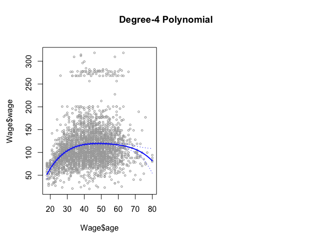

This is just like the figure we saw in the book! It's cool to observe how our model looks against the data.

Now we explore using different degrees of polynomials. We want the lowest polynomial that explains the relationship between wage and age sufficiently well. We can do this with hypothesis tests, specifically using the `anova()` function, which performs F-tests with the null: simpler model is sufficent, and the alternative: a more complex model is necessary. So, to do this, we fit 5 models, one for each degree polynomial (up to 5), and then we use the ANOVA function to compare.

``` r
fit1 = lm(wage~age, data = Wage)
fit2 = lm(wage~poly(age, 2), data=Wage)
fit3 = lm(wage~age + I(age^2) + I(age^3), data=Wage)  # recall this syntax
fit4 = lm(wage~poly(age, 4), data=Wage)
fit5 = lm(wage~poly(age, 5), data=Wage)
anova(fit1, fit2, fit3, fit4, fit5)
```

    ## Analysis of Variance Table
    ## 
    ## Model 1: wage ~ age
    ## Model 2: wage ~ poly(age, 2)
    ## Model 3: wage ~ age + I(age^2) + I(age^3)
    ## Model 4: wage ~ poly(age, 4)
    ## Model 5: wage ~ poly(age, 5)
    ##   Res.Df     RSS Df Sum of Sq        F    Pr(>F)    
    ## 1   2998 5022216                                    
    ## 2   2997 4793430  1    228786 143.5931 < 2.2e-16 ***
    ## 3   2996 4777674  1     15756   9.8888  0.001679 ** 
    ## 4   2995 4771604  1      6070   3.8098  0.051046 .  
    ## 5   2994 4770322  1      1283   0.8050  0.369682    
    ## ---
    ## Signif. codes:  0 '***' 0.001 '**' 0.01 '*' 0.05 '.' 0.1 ' ' 1

To interpret this, we look at the p-values. The hypothesis test comparing model 1 to model 2 is virtually 0, meaning a linear fit doesn't suffice. The one for model 2 vs. model 3 is also quite low, indicating a quadratic fit doesn't do the job. The one for model 3 vs. 4 is about 5%, and the one for model 4 vs. 5 is about 37%. The latter clearly shows a 5th degree polynomial is too much, and so we are left with a choice between the cubic and degree 4 polynomial. Either is a good choice.

Importantly, we note that we could've gotten these p-values using just the following:

``` r
summary(fit5)
```

    ## 
    ## Call:
    ## lm(formula = wage ~ poly(age, 5), data = Wage)
    ## 
    ## Residuals:
    ##     Min      1Q  Median      3Q     Max 
    ## -99.049 -24.386  -5.028  15.344 202.886 
    ## 
    ## Coefficients:
    ##                Estimate Std. Error t value Pr(>|t|)    
    ## (Intercept)    111.7036     0.7288 153.278  < 2e-16 ***
    ## poly(age, 5)1  447.0679    39.9161  11.200  < 2e-16 ***
    ## poly(age, 5)2 -478.3158    39.9161 -11.983  < 2e-16 ***
    ## poly(age, 5)3  125.5217    39.9161   3.145  0.00168 ** 
    ## poly(age, 5)4  -77.9112    39.9161  -1.952  0.05105 .  
    ## poly(age, 5)5  -35.8129    39.9161  -0.897  0.36968    
    ## ---
    ## Signif. codes:  0 '***' 0.001 '**' 0.01 '*' 0.05 '.' 0.1 ' ' 1
    ## 
    ## Residual standard error: 39.92 on 2994 degrees of freedom
    ## Multiple R-squared:  0.08651,    Adjusted R-squared:  0.08498 
    ## F-statistic: 56.71 on 5 and 2994 DF,  p-value: < 2.2e-16

This is because the default way of using `poly()` uses orthogonal polynomials. However, ANOVA works in a more general case, including if we added more predictors.

Finally, we could've also used our handy cross-validation tool to choose the polynomial degree, which we have seen many times in the recent labs.

#### Now, let's handle a logistic regression problem: predicting if an individual will make &gt;$250,000 per year.

``` r
logistic_fit = glm(I(wage>250)~poly(age, 4), data=Wage, family = binomial)  # We just use 250 since wage is given in thousands of dollars. Also I() creates a logical vector, and glm() converts the TRUEs and FALSEs to 1s and 0s for us.

# predictions
preds = predict(logistic_fit, newdata=list(age=age_grid), se=T)  # these are the log-odds predictions

# transform from log-odds to normal probabilities with sigmoid function
good_preds = exp(preds$fit)/(1 + exp(preds$fit))
se_bands_log_odds = cbind(preds$fit + 2*preds$se.fit, preds$fit - 2*preds$se.fit)
good_se_bands = exp(se_bands_log_odds)/(1 + exp(se_bands_log_odds))

# Plot
plot(Wage$age, I(Wage$wage > 250) ,xlim = age_lims, type="n", ylim=c(0, .2))
points(jitter(Wage$age), I((Wage$wage > 250) / 5), cex=0.5, pch="|", col = "darkgrey")
lines(age_grid, good_preds , lwd=2, col="blue")
matlines(age_grid, good_se_bands, lwd=1, col="blue", lty=3)
```

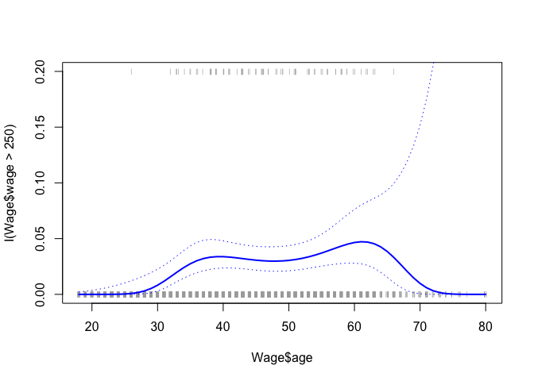

Cool! Just like what we saw earlier in the chapter.

#### Now, let's fit a step function. Yes, we saw this method is inadequate for this situation, but it's useful to know how to do it in R.

``` r
# See frequency of observations in each age bin. Here we let cut create 5 bins automatically.
table(cut(Wage$age, 5))  # cut() returns an ordered categorical variable
```

    ## 
    ## (17.9,30.4] (30.4,42.8] (42.8,55.2] (55.2,67.6] (67.6,80.1] 
    ##         522         987        1081         366          44

``` r
# Step function model uses lm(), and employs dummy variables to handle the bins
fit = lm(wage~cut(age, 4), data=Wage)
coef(summary(fit))
```

    ##                         Estimate Std. Error   t value     Pr(>|t|)
    ## (Intercept)            94.158392   1.476069 63.789970 0.000000e+00
    ## cut(age, 4)(33.5,49]   24.053491   1.829431 13.148074 1.982315e-38
    ## cut(age, 4)(49,64.5]   23.664559   2.067958 11.443444 1.040750e-29
    ## cut(age, 4)(64.5,80.1]  7.640592   4.987424  1.531972 1.256350e-01

The only important thing to remember here is that the `age < 33.5` bin information is in the intercept, i.e. the average wage of someone younger than 33.5 is a little over $94,000.

### Now we consider the same problem, but this time use splines as our learning method!

First we look at regression splines, which we remember are constructed from an approprite choice of basis functions. R employs cubic splines by default.

``` r
library(splines)

fit = lm(wage~bs(age, knots=c(25, 40, 60)), data=Wage)  # bs() generates matrix of basis functions with the knots we choose
preds = predict(fit, newdata = list(age = age_grid), se=T)
plot(Wage$age, Wage$wage, col='gray')
lines(age_grid, preds$fit,lwd=2)
lines(age_grid, preds$fit + 2*preds$se, lty="dashed")
lines(age_grid, preds$fit - 2*preds$se, lty="dashed")
title('Cubic Spline')
```

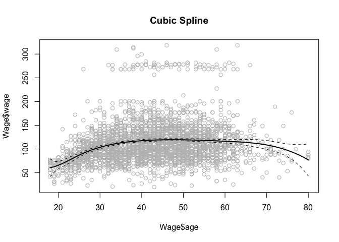

If instead of specifying our own knots we wanted R to choose them uniformly, we can set our desired value of degrees of freedom. We remember that a cubic spline has K+4 degrees of freedom in general, where K is the number of knots. This is because there are K+3 predictors, each of which is a basis function, and we are left with the intercept term.

``` r
# use df argument to choose knots uniformly
dim(bs(Wage$age, df=6))  # df=6 means 6 basis functions, i.e. 3 knots
```

    ## [1] 3000    6

``` r
attr(bs(Wage$age, df=6), "knots")
```

    ##   25%   50%   75% 
    ## 33.75 42.00 51.00

So, we see the 25th, 50th, and 75th percentiles of age, which correspond to 33.8, 42, and 51 respectively. These would be our knots in this cubic spline.

If we wanted to, we could use `bs()`'s `degree` parameter to fit a spline of any degree, but we just use the default of 3 here.

Now, let's fit a natural spline!

``` r
natural_spline_fit = lm(wage~ns(age, df=4), data=Wage)  # natural spline uses ns(), and here we use 4 degrees of freedom, i.e. 1 knot
natural_preds = predict(natural_spline_fit, newdata=list(age = age_grid), se=T)
plot(Wage$age, Wage$wage, col='gray')
lines(age_grid, natural_preds$fit,lwd=2)
lines(age_grid, natural_preds$fit + 2*natural_preds$se, lty="dashed")
lines(age_grid, natural_preds$fit - 2*natural_preds$se, lty="dashed")
title('Natural Spline')
```


``` r
# Let's plot the results of a smoothing spline
plot(Wage$age, Wage$wage, xlim = age_lims, cex=0.5, col="darkgrey")
title ("Smoothing Spline")
fit = smooth.spline(Wage$age, Wage$wage, df=16)  # fit smoothing spline with 16 DoF, R determines the corresponding value of lambda
fit2 = smooth.spline(Wage$age, Wage$wage, cv=TRUE)  # uses cross-validation to pick lambda, resulting in 6.8 DoF 
```

    ## Warning in smooth.spline(Wage$age, Wage$wage, cv = TRUE): cross-validation
    ## with non-unique 'x' values seems doubtful

``` r
fit2$df
```

    ## [1] 6.794596

``` r
lines(fit, col="red", lwd=2)
lines(fit2, col="blue", lwd=2)
legend("topright", legend=c("16 DF","6.8 DF"), col=c("red","blue"), lty=1, lwd=2, cex=.8)
```

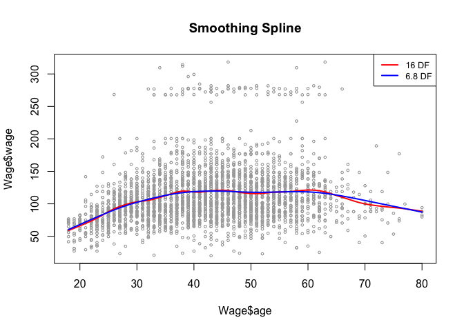

Finally, let's see local regression.

``` r
plot(Wage$age, Wage$wage, xlim=age_lims, cex=.5, col="darkgrey")
title("Local Regression")
fit = loess(wage~age, span=0.2, data=Wage)  # fit local regression with 0.2 span
fit2 = loess(wage~age, span=0.5, data=Wage)  # another local regression, this one with 0.5 span
lines(age_grid, predict(fit, data.frame(age=age_grid)), col="red", lwd=2)
lines(age_grid, predict(fit2, data.frame(age=age_grid)), col="blue", lwd=2)
legend("topright" ,legend = c("Span=0.2","Span=0.5"), col = c("red","blue"), lty=1, lwd=2, cex=.8)
```

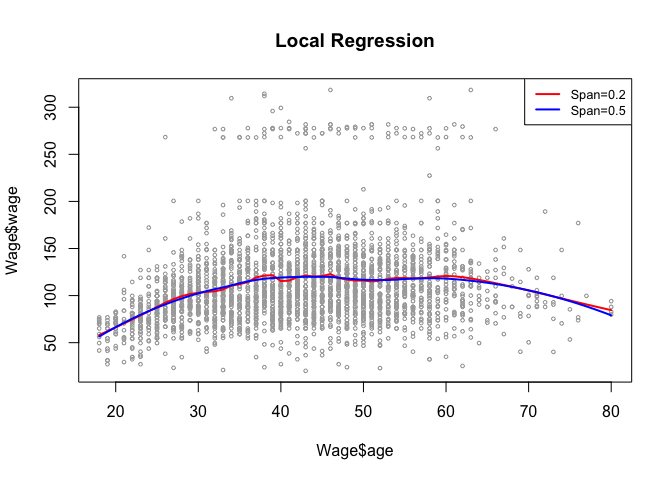

The key thing to remember here is that the `span` parameter tells us the proportion of points used in each neighborhood. That is, a span of 0.2 means 20% of observations are used in each neighborhood, and a span of 0.5 means 50%. The higher the span, the smoother the fit, which is intuitive!

### GAMs

First, we'll predict wage using natural splines with the predictors year and age, and we'll use a step function on education. This is basically just a big linear regression with a choice of basis functions, so we use `lm()`.

``` r
gam1 = lm(wage~ns(year, 4) + ns(age, 5) + education, data=Wage)
coef(summary(gam1))
```

    ##                              Estimate Std. Error    t value      Pr(>|t|)
    ## (Intercept)                 46.949491   4.704182  9.9803733  4.255933e-23
    ## ns(year, 4)1                 8.624692   3.466060  2.4883275  1.288867e-02
    ## ns(year, 4)2                 3.762266   2.959187  1.2713851  2.036907e-01
    ## ns(year, 4)3                 8.126549   4.211446  1.9296340  5.374684e-02
    ## ns(year, 4)4                 6.806473   2.396969  2.8396166  4.547335e-03
    ## ns(age, 5)1                 45.170123   4.193491 10.7714834  1.435245e-26
    ## ns(age, 5)2                 38.449704   5.076174  7.5745439  4.775895e-14
    ## ns(age, 5)3                 34.239237   4.382517  7.8126879  7.692241e-15
    ## ns(age, 5)4                 48.677634  10.571609  4.6045623  4.306057e-06
    ## ns(age, 5)5                  6.557265   8.367147  0.7836919  4.332831e-01
    ## education2. HS Grad         10.983419   2.430148  4.5196494  6.434935e-06
    ## education3. Some College    23.472889   2.561672  9.1631133  9.124942e-20
    ## education4. College Grad    38.313667   2.547137 15.0418574  2.397682e-49
    ## education5. Advanced Degree 62.553971   2.761309 22.6537345 5.566864e-105

But, if we want to use smoothing splines, or just any method that doesn't solely depend on a choice of basis functions that can be fit with OLS, we have to use the `gam` library. Let's see this now.

``` r
library(gam)
```

    ## Warning: package 'gam' was built under R version 3.5.2

    ## Loading required package: foreach

    ## Loaded gam 1.16.1

``` r
gam2 = gam(wage~s(year, 4) + s(age, 5) + education, data=Wage)  # s() indicates smoothing spline with corresponding DoF, and education is qualitative

# plot results
par(mfrow=c(1, 3))
plot(gam2, se=T, col='blue')
```

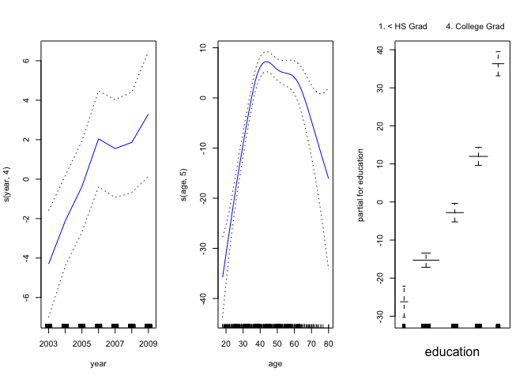

Cool plot! Interestingly, even though `gam1` isn't of class `gam` (it's of `lm`), we can still use `plot.Gam()` to plot it:

``` r
plot.Gam(gam1, se=T, col='red')
```

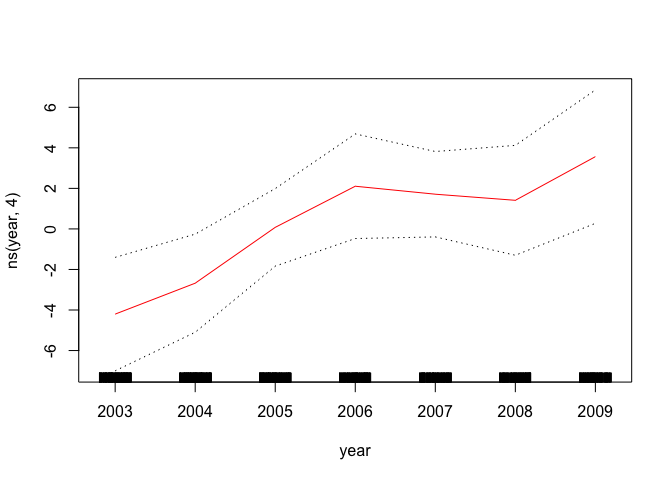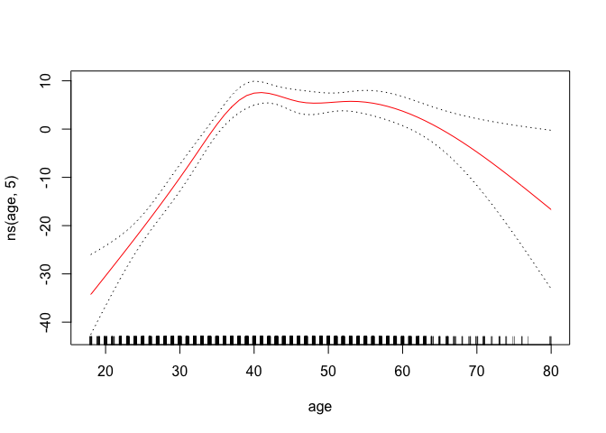

Nice! We notice `year` looks linear, so maybe we should run an ANOVA test to see if it's worth including in our model.

``` r
# Run ANOVA to see if year predictor is valuable
gam_m1 = gam(wage~s(age, 5) + education, data=Wage)  # no year
gam_m2 = gam(wage~year + s(age, 5) + education, data=Wage)  # linear function of year
anova(gam_m1, gam_m2, gam2, test="F")  # smoothing spline of year 
```

    ## Analysis of Deviance Table
    ## 
    ## Model 1: wage ~ s(age, 5) + education
    ## Model 2: wage ~ year + s(age, 5) + education
    ## Model 3: wage ~ s(year, 4) + s(age, 5) + education
    ##   Resid. Df Resid. Dev Df Deviance       F    Pr(>F)    
    ## 1      2990    3711731                                  
    ## 2      2989    3693842  1  17889.2 14.4771 0.0001447 ***
    ## 3      2986    3689770  3   4071.1  1.0982 0.3485661    
    ## ---
    ## Signif. codes:  0 '***' 0.001 '**' 0.01 '*' 0.05 '.' 0.1 ' ' 1

Looking at the p-values, we see that the model using a linear function of year is better than not including it at all. Then, we see that the third model that uses a smoothing spline of year doesn't convince us that it should be used over model 2, because p=0.35. So, we'll pick model 2.

``` r
# summary of model 2
summary(gam_m2)
```

    ## 
    ## Call: gam(formula = wage ~ year + s(age, 5) + education, data = Wage)
    ## Deviance Residuals:
    ##      Min       1Q   Median       3Q      Max 
    ## -119.959  -19.647   -3.199   13.969  213.562 
    ## 
    ## (Dispersion Parameter for gaussian family taken to be 1235.812)
    ## 
    ##     Null Deviance: 5222086 on 2999 degrees of freedom
    ## Residual Deviance: 3693842 on 2989 degrees of freedom
    ## AIC: 29885.06 
    ## 
    ## Number of Local Scoring Iterations: 2 
    ## 
    ## Anova for Parametric Effects
    ##             Df  Sum Sq Mean Sq F value    Pr(>F)    
    ## year         1   27154   27154  21.973  2.89e-06 ***
    ## s(age, 5)    1  194535  194535 157.415 < 2.2e-16 ***
    ## education    4 1069081  267270 216.271 < 2.2e-16 ***
    ## Residuals 2989 3693842    1236                      
    ## ---
    ## Signif. codes:  0 '***' 0.001 '**' 0.01 '*' 0.05 '.' 0.1 ' ' 1
    ## 
    ## Anova for Nonparametric Effects
    ##             Npar Df Npar F     Pr(F)    
    ## (Intercept)                             
    ## year                                    
    ## s(age, 5)         4  32.46 < 2.2e-16 ***
    ## education                               
    ## ---
    ## Signif. codes:  0 '***' 0.001 '**' 0.01 '*' 0.05 '.' 0.1 ' ' 1

The small p-values here support our conclusion.

``` r
# Make predictions... same way as with lm() objects
gam_preds = predict(gam_m2, newdata=Wage)
```

``` r
# Local regression and GAMs
gam_lo = gam(wage~s(year, df=4) + lo(age, span=0.7) + education, data=Wage)  # lo() function performs local regression with chosen span
plot.Gam(gam_lo, se=T, col='green')
```

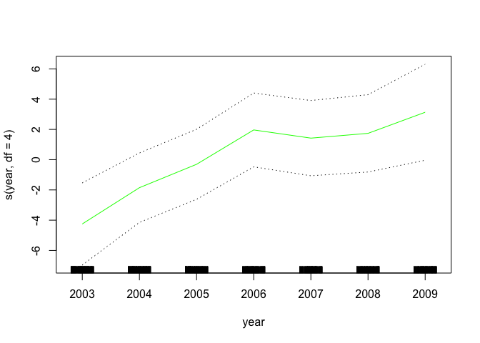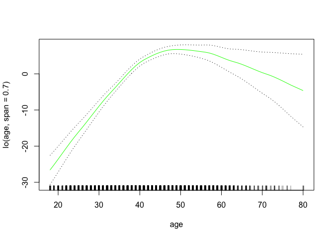

``` r
# Can also use interaction term in lo()
gam_inter_lo = gam(wage~lo(year, age, span=0.5) + education, data=Wage)
```

    ## Warning in lo.wam(x, z, wz, fit$smooth, which, fit$smooth.frame,
    ## bf.maxit, : liv too small. (Discovered by lowesd)

    ## Warning in lo.wam(x, z, wz, fit$smooth, which, fit$smooth.frame,
    ## bf.maxit, : lv too small. (Discovered by lowesd)

    ## Warning in lo.wam(x, z, wz, fit$smooth, which, fit$smooth.frame,
    ## bf.maxit, : liv too small. (Discovered by lowesd)

    ## Warning in lo.wam(x, z, wz, fit$smooth, which, fit$smooth.frame,
    ## bf.maxit, : lv too small. (Discovered by lowesd)

``` r
# Plot
library(akima)
```

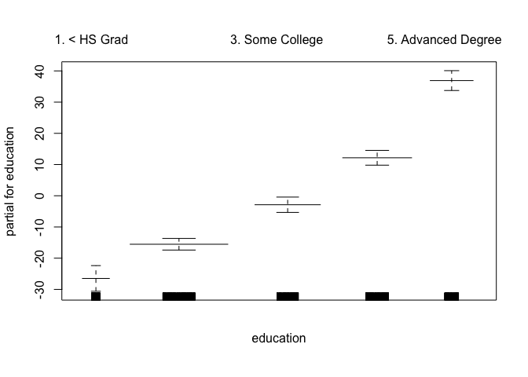

``` r
plot(gam_inter_lo)  # plots 2D surface of interaction term
```

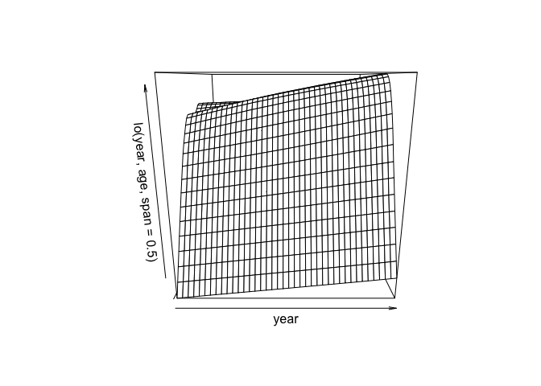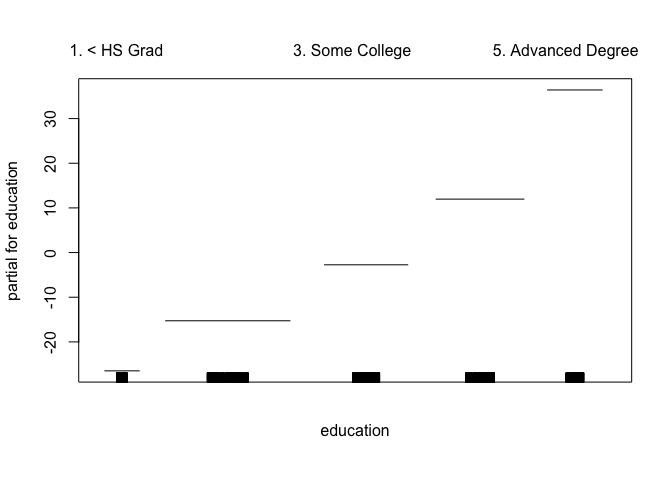

``` r
# Logistic regression and GAMs
gam_lr = gam(I(wage > 250)~year + s(age, df=5) + education, family=binomial, data=Wage)
par(mfrow = c(1, 3))
plot(gam_lr, se=T, col="green")
```

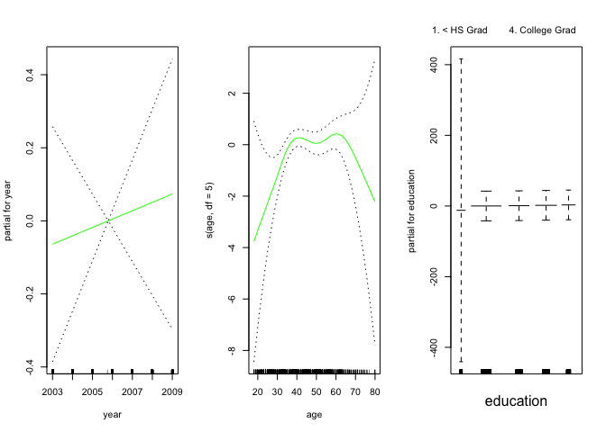

The SE bar for `<HS` is so wide because there are no observations in this category that earn over $250,000 per year.

``` r
# we see the # of earners of over 250k here
table(Wage$education, I(Wage$wage > 250))  # indicator variable that table() uses to count TRUEs and FALSEs as 1s and 0s
```

    ##                     
    ##                      FALSE TRUE
    ##   1. < HS Grad         268    0
    ##   2. HS Grad           966    5
    ##   3. Some College      643    7
    ##   4. College Grad      663   22
    ##   5. Advanced Degree   381   45

This table confirms our observation. Given this, we can fit a GAM that excludes this subset of our observations to get better results.

``` r
gam_lr_s = gam(I(wage > 250)~year + s(age, df=5) + education, data=Wage, family=binomial, subset = (education != '1. < HS Grad'))  # fancy subsetting syntax...
plot(gam_lr_s, se=T, col="green")
```

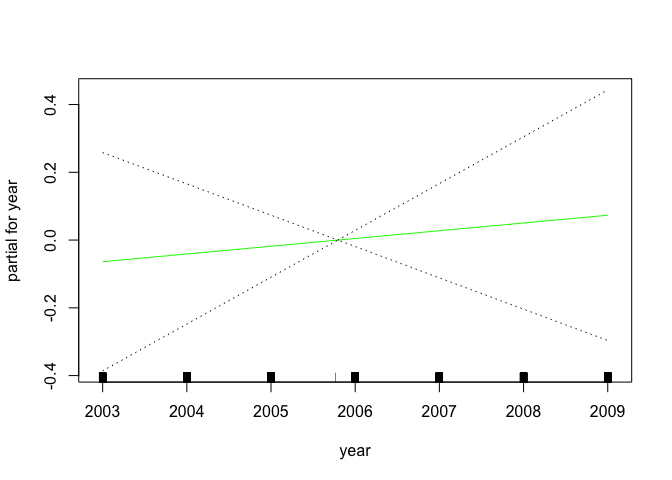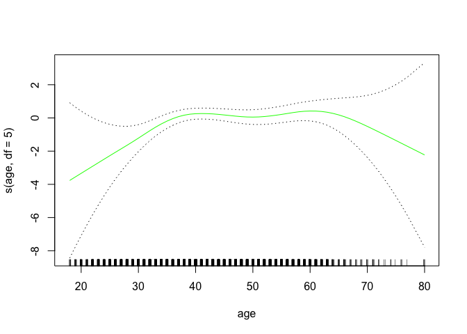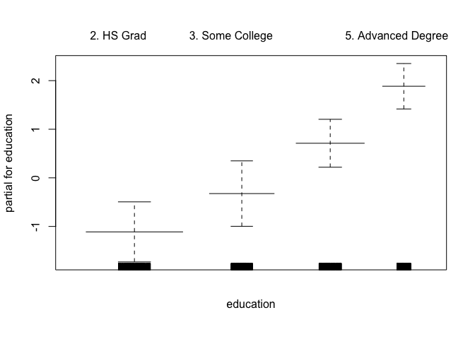

And just like that, the super wide error bars for `< HS Grad` are gone! These results make sense. Overall, the flexibility of GAMs is actually really cool and nice. Using multiple learning methods in one model for different predictors, whether quantitative or categorical, all at the same time preserving easy inference... is super interesting!
