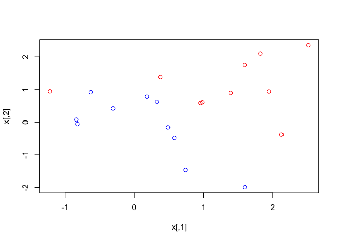
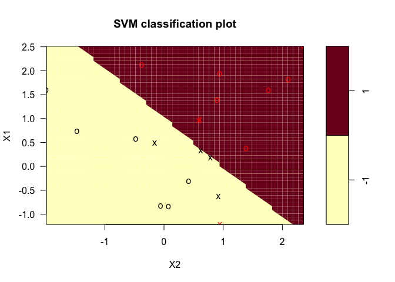
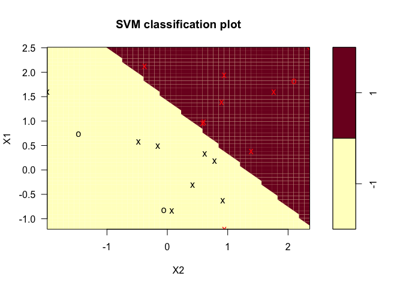
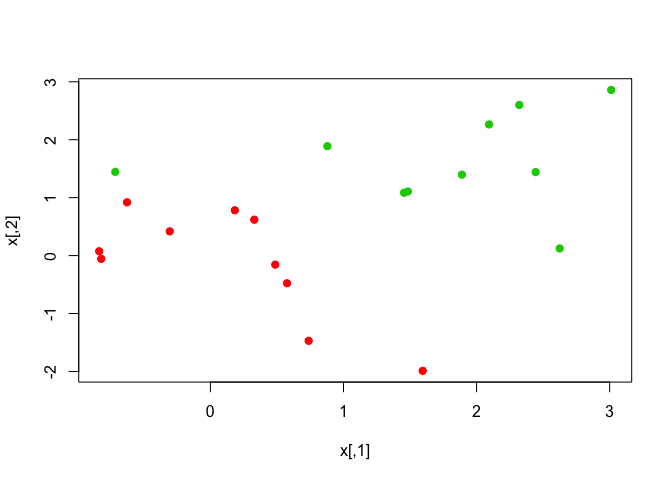
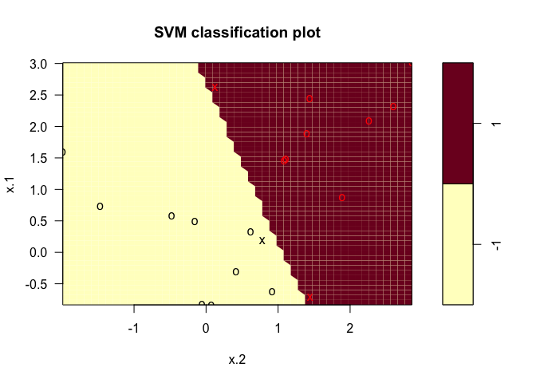
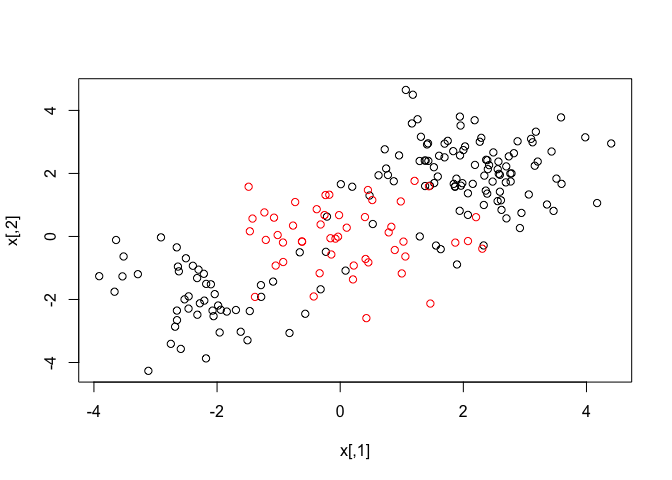
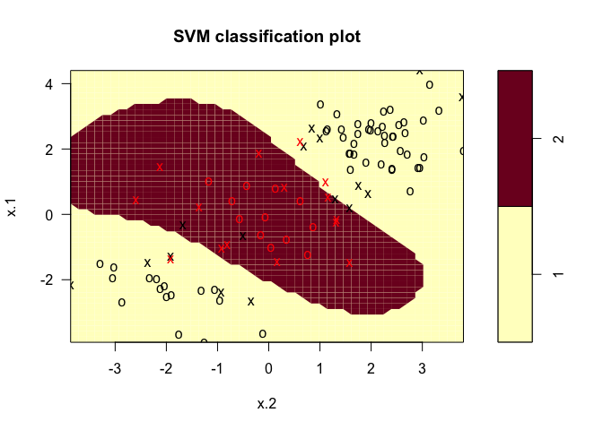
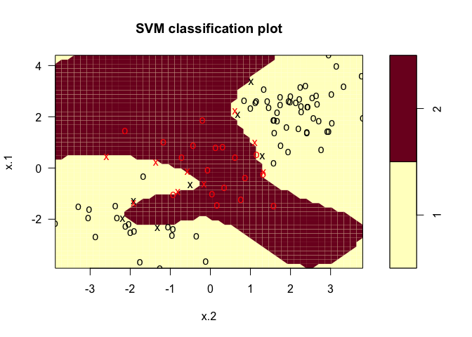
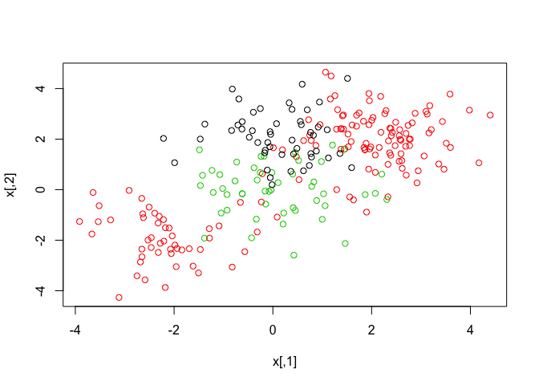
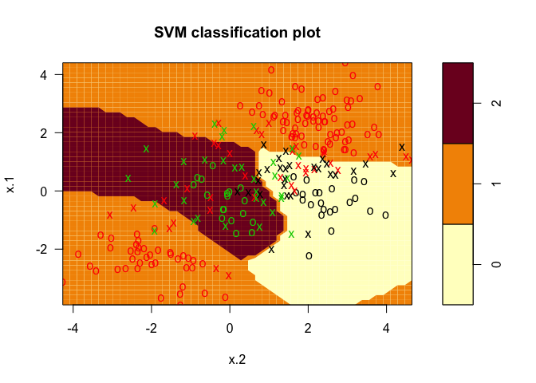

support\_vector\_macines.Rmd
================

Lab: Support Vector Machines
============================

### In this lab, we'll use the `e1071` library in R to work through examples using the support vector classifier and the SVM. First, we look at the support vector classifier.

``` r
# Generate data
set.seed(1)
x = matrix(rnorm(20*2), ncol=2)  # observations
y = c(rep(-1, 10), rep(1, 10))  # classes
x[y==1,] = x[y==1,] + 1

# plot data
plot(x, col = 3-y)
```



It's clear from this plot that our data isn't linearly separable. Now, let's fit a support vector classifier to it.

``` r
library(e1071)
dat = data.frame(x, y = as.factor(y))  # must factorize y to perform classification
svm_fit = svm(y ~ ., data=dat, kernel = 'linear', cost = 10, scale = F)  # kernel = linear ensures support vector classifier

# plot results
plot(svm_fit, dat)
```



We see that only one observation is incorrectly classified--the red X down in the bottom right part of the plot. The support vectors are these Xs.

``` r
# support vector indices
svm_fit$index
```

    ## [1]  1  2  5  7 14 16 17

``` r
# summary
summary(svm_fit)
```

    ## 
    ## Call:
    ## svm(formula = y ~ ., data = dat, kernel = "linear", cost = 10, 
    ##     scale = F)
    ## 
    ## 
    ## Parameters:
    ##    SVM-Type:  C-classification 
    ##  SVM-Kernel:  linear 
    ##        cost:  10 
    ## 
    ## Number of Support Vectors:  7
    ## 
    ##  ( 4 3 )
    ## 
    ## 
    ## Number of Classes:  2 
    ## 
    ## Levels: 
    ##  -1 1

``` r
# what if we change the value of cost this time...
svm_fit = svm(y ~ ., data=dat, kernel='linear', cost=0.1, scale=F)
plot(svm_fit, dat)
```



Since we've shrunk the `cost` parameter here, the margin is wider and thus there are more support vectors (this time we have 16).

Now, we can use the `tune()` function to perform 10-fold CV on models of interest, which we specify in the function's parameters.

``` r
set.seed(1)
tune_svm = tune(svm, y~., data=dat, kernel='linear', ranges=list(cost=c(0.001, 0.01, 0.1, 1,5,10,100)))
summary(tune_svm)
```

    ## 
    ## Parameter tuning of 'svm':
    ## 
    ## - sampling method: 10-fold cross validation 
    ## 
    ## - best parameters:
    ##  cost
    ##   0.1
    ## 
    ## - best performance: 0.05 
    ## 
    ## - Detailed performance results:
    ##    cost error dispersion
    ## 1 1e-03  0.55  0.4377975
    ## 2 1e-02  0.55  0.4377975
    ## 3 1e-01  0.05  0.1581139
    ## 4 1e+00  0.15  0.2415229
    ## 5 5e+00  0.15  0.2415229
    ## 6 1e+01  0.15  0.2415229
    ## 7 1e+02  0.15  0.2415229

The returned data frame shows us that using `cost = 0.1` will give us best results. We can also access the best model as follows:

``` r
best_svm = tune_svm$best.model
summary(best_svm)
```

    ## 
    ## Call:
    ## best.tune(method = svm, train.x = y ~ ., data = dat, ranges = list(cost = c(0.001, 
    ##     0.01, 0.1, 1, 5, 10, 100)), kernel = "linear")
    ## 
    ## 
    ## Parameters:
    ##    SVM-Type:  C-classification 
    ##  SVM-Kernel:  linear 
    ##        cost:  0.1 
    ## 
    ## Number of Support Vectors:  16
    ## 
    ##  ( 8 8 )
    ## 
    ## 
    ## Number of Classes:  2 
    ## 
    ## Levels: 
    ##  -1 1

And as we expect, we see `cost=0.1` was used!

As with many other methods we've seen, we can make predictions on the test use using `predict()`. Let's generate a test set and do so.

``` r
xtest = matrix(rnorm(20*2), ncol=2)
ytest = sample(c(-1, 1), 20, rep=T)
xtest[ytest==1, ] = xtest[ytest==1, ] + 1
test_set = data.frame(x=xtest, y=as.factor(ytest))
colnames(test_set) = c('X1', 'X2', 'y')

preds = predict(best_svm, test_set)
table(predict = preds, truth = test_set$y)
```

    ##        truth
    ## predict -1 1
    ##      -1  9 1
    ##      1   2 8

This table shows us that we predict 17 obervations correctly out of 20.

Let's look at a linearly separable example now!

``` r
# generate linearly separable data
x[y==1,]=x[y==1,]+0.5
plot(x, col=(y+5)/2, pch=19)
```



Data is linearly separable!

``` r
# Fit support vec classifier and plot hyperplane
dat = data.frame(x = x, y = as.factor(y))
svm_fit = svm(y~., data=dat, kernel='linear', cost=1e5)  # use high value of cost to fit hard to the data
summary(svm_fit)
```

    ## 
    ## Call:
    ## svm(formula = y ~ ., data = dat, kernel = "linear", cost = 1e+05)
    ## 
    ## 
    ## Parameters:
    ##    SVM-Type:  C-classification 
    ##  SVM-Kernel:  linear 
    ##        cost:  1e+05 
    ## 
    ## Number of Support Vectors:  3
    ## 
    ##  ( 1 2 )
    ## 
    ## 
    ## Number of Classes:  2 
    ## 
    ## Levels: 
    ##  -1 1

``` r
# plot
plot(svm_fit, dat)
```



So, we see from this plot that we only used 3 support vectors, and, as expected, all training observations were correctly classified. We should note, though, that using such a small margin probably amounts to a high variance classifier.

### Support Vector Machines

``` r
# Generate data
set.seed(1)
x = matrix(rnorm(200*2), ncol=2)  # training data
x[1:100, ] = x[1:100, ] + 2
x[101:150, ] = x[101:150, ] - 2
y = c(rep(1, 150), rep(2, 50))  # class labels
dat = data.frame(x=x, y=as.factor(y))

plot(x, col=y)
```



Given this plot, it's clear that a linear decision boundary will be useless. Let's generate training data and then try some SVMs to see our results.

``` r
train_indices = sample(200, 100)
svm_fit = svm(y~., data=dat[train_indices, ], kernel='radial', gamma=1, cost=1)  # radial kernel
plot(svm_fit, dat[train_indices, ])
```



Cool! We do see that we make some mistakes, which we might be able to fix by increasing the `cost` parameter (at the risk of overfitting, importantly).

``` r
svm_fit = svm(y~., data=dat[train_indices, ], kernel='radial', gamma=1, cost=1e5)  # radial kernel with much bigger cost, fit to data harder
plot(svm_fit, dat[train_indices, ])
```



What we see is expected--the boundary is now much more flexible.

Let's use `tune()` again to select the `cost` and `gamma` parameters.

``` r
set.seed(1)
tuned = tune(svm, y~., data=dat[train_indices,], kernel="radial",
ranges=list(cost=c(0.1, 1, 10, 100, 1000), gamma=c(0.5, 1, 2, 3, 4)))
summary(tuned)
```

    ## 
    ## Parameter tuning of 'svm':
    ## 
    ## - sampling method: 10-fold cross validation 
    ## 
    ## - best parameters:
    ##  cost gamma
    ##     1   0.5
    ## 
    ## - best performance: 0.07 
    ## 
    ## - Detailed performance results:
    ##     cost gamma error dispersion
    ## 1  1e-01   0.5  0.26 0.15776213
    ## 2  1e+00   0.5  0.07 0.08232726
    ## 3  1e+01   0.5  0.07 0.08232726
    ## 4  1e+02   0.5  0.14 0.15055453
    ## 5  1e+03   0.5  0.11 0.07378648
    ## 6  1e-01   1.0  0.22 0.16193277
    ## 7  1e+00   1.0  0.07 0.08232726
    ## 8  1e+01   1.0  0.09 0.07378648
    ## 9  1e+02   1.0  0.12 0.12292726
    ## 10 1e+03   1.0  0.11 0.11005049
    ## 11 1e-01   2.0  0.27 0.15670212
    ## 12 1e+00   2.0  0.07 0.08232726
    ## 13 1e+01   2.0  0.11 0.07378648
    ## 14 1e+02   2.0  0.12 0.13165612
    ## 15 1e+03   2.0  0.16 0.13498971
    ## 16 1e-01   3.0  0.27 0.15670212
    ## 17 1e+00   3.0  0.07 0.08232726
    ## 18 1e+01   3.0  0.08 0.07888106
    ## 19 1e+02   3.0  0.13 0.14181365
    ## 20 1e+03   3.0  0.15 0.13540064
    ## 21 1e-01   4.0  0.27 0.15670212
    ## 22 1e+00   4.0  0.07 0.08232726
    ## 23 1e+01   4.0  0.09 0.07378648
    ## 24 1e+02   4.0  0.13 0.14181365
    ## 25 1e+03   4.0  0.15 0.13540064

We see that the optimal parameters for `cost` and `gamma` are 10 and 0.5 respectively. Let's make predictions using this best model and check our error.

``` r
preds = predict(tuned$best.model, dat[-train_indices, ])
table(predict = preds, truth = dat[-train_indices, 'y'])
```

    ##        truth
    ## predict  1  2
    ##       1 67  2
    ##       2 10 21

So, on the test set our error rate is 12%. Not bad!

### SVM with Multiple Classes

``` r
set.seed(1)
# generate 3rd class
x = rbind(x, matrix(rnorm(50*2), ncol=2))
y = c(y, rep(0,50))
x[y==0, 2] = x[y==0, 2] + 2
dat = data.frame(x=x, y = as.factor(y))
par(mfrow=c(1,1))
plot(x, col=(y + 1))
```



We will use `svm()` to classify observations for 3 classes, this time, which will use the one-versus-one approach. In this approach, we make ${K \\choose 2}$ classifiers, each will compare one class to another, pairwise. Obviously in this case, *K* = 3. So we form 3 classifiers, and assign an observation to the class which it is assigned to the majority of the time.

``` r
svm_fit = svm(y ~ ., data=dat, kernel='radial', cost=10, gamma=0.5)
plot(svm_fit, dat)
```



This plot is hard to read because there are a lot of observations, but the classifier seems to do a decent job. We make most of our mistakes in the middle, which makes sense given the nature/overlap of the data there.

### Application to Gene Expression Data

In this application, we'll look at the `Khan` data set, which contains tissue sample information and the corresponding four distinct types of small round blue cell tumors.

``` r
library(ISLR)
names(Khan)  # comes with train and test data already split
```

    ## [1] "xtrain" "xtest"  "ytrain" "ytest"

``` r
dim(Khan$xtrain)
```

    ## [1]   63 2308

``` r
dim(Khan$xtest)
```

    ## [1]   20 2308

``` r
length(Khan$ytrain)
```

    ## [1] 63

``` r
length(Khan$ytest)
```

    ## [1] 20

``` r
table(Khan$ytrain)
```

    ## 
    ##  1  2  3  4 
    ##  8 23 12 20

We have a bunch of predictors here, which correspond to measurements of 2308 genes. Because *p* &gt; &gt;*n* here, we should use a linear kernel, since any more flexibility will be unnecessary.

``` r
# Organize data
dat = data.frame(x = Khan$xtrain, y = as.factor(Khan$ytrain))
# Fit support vector classifier
svm_fit = svm(y ~ ., data=dat, kernel='linear', cost=10)
summary(svm_fit)
```

    ## 
    ## Call:
    ## svm(formula = y ~ ., data = dat, kernel = "linear", cost = 10)
    ## 
    ## 
    ## Parameters:
    ##    SVM-Type:  C-classification 
    ##  SVM-Kernel:  linear 
    ##        cost:  10 
    ## 
    ## Number of Support Vectors:  58
    ## 
    ##  ( 20 20 11 7 )
    ## 
    ## 
    ## Number of Classes:  4 
    ## 
    ## Levels: 
    ##  1 2 3 4

``` r
table(svm_fit$fitted, dat$y)
```

    ##    
    ##      1  2  3  4
    ##   1  8  0  0  0
    ##   2  0 23  0  0
    ##   3  0  0 12  0
    ##   4  0  0  0 20

Wow, no training errors. This must be because it's easier to find separating hyperplanes in such a large space with so few observations. Let's see how we do on the test set now.

``` r
preds = predict(svm_fit, data.frame(x=Khan$xtest, y=as.factor(Khan$ytest)))
table(predicted = preds, truth = Khan$ytest)
```

    ##          truth
    ## predicted 1 2 3 4
    ##         1 3 0 0 0
    ##         2 0 6 2 0
    ##         3 0 0 4 0
    ##         4 0 0 0 5

We make 2 errors out of 20 for an error rate of 10%. Not too bad!

With this lab, we conclude the supervised learning portion of the book... wow! We've seen so many supervised learning methods that altogether they're a little hard to completely grasp, but it's nice to have these tools now!
