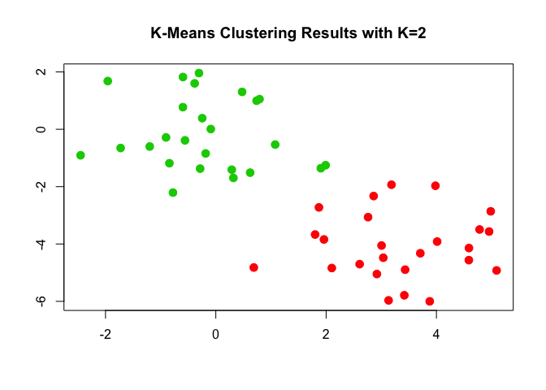
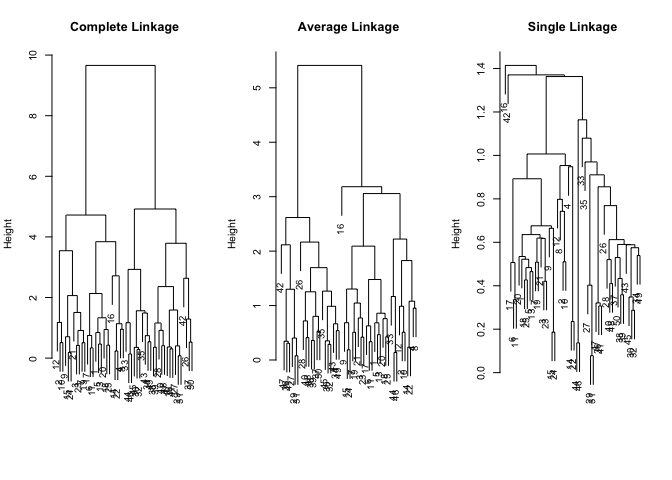
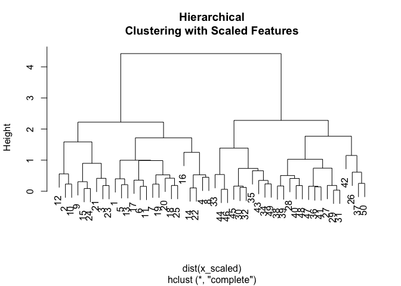
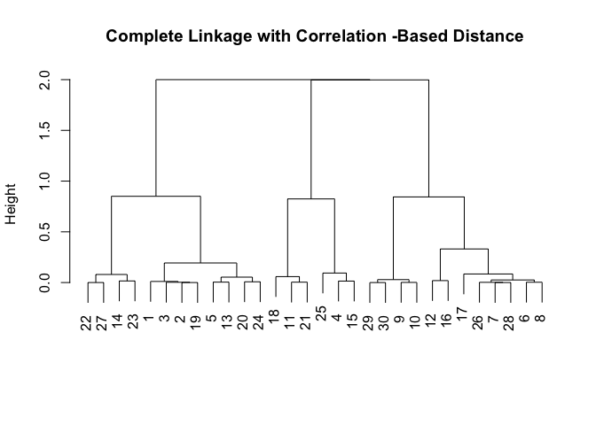

clustering.Rmd
================

Lab: Clustering
===============

### In this lab, we'll see how K-means clustering and Hierarchical clustering works in R. We start with K-means.

``` r
# generate data
set.seed(2)
x = matrix(rnorm(50*2), ncol=2)
x[1:25, 1] = x[1:25, 1] + 3
x[1:25, 2] = x[1:25, 2] - 4

# k-means cluster
km_out = kmeans(x, 2, nstart=20)  # K=2 with 20 different starting configurations to test
km_out$cluster
```

    ##  [1] 1 1 1 1 1 1 1 1 1 1 1 1 1 1 1 1 1 1 1 1 1 1 1 1 1 2 2 2 2 2 2 2 2 2 2
    ## [36] 2 2 2 2 2 2 2 2 2 2 2 2 2 2 2

These are the cluster assignments for each of the 50 observations.

``` r
# plot them
plot(x, col=(km_out$cluster + 1), main="K-Means Clustering Results with K=2", xlab="", ylab="", pch=20, cex=2)
```



Cool! This gives us a nice and easy to read plot. In practice, we obvioulsly will not have generated our own data, and hence the clusters will not be known beforehand. Also, using a high value (20-50) for `nstart` is also critical since it will allow us to find a good local optimum.

### Hierarchical Clustering

Here, we will use the euclidean distance as our dissimilarity measure, and show several types of linkage. We will use the same data from above.

``` r
# Cluster hierarchically
hc_comp = hclust(dist(x), method='complete')  # complete linkage w/ euclid. distance
hc_avg = hclust(dist(x), method='average')  # average linkage
hc_single = hclust(dist(x), method='single')  # single linkage

# plot dendrograms
par(mfrow=c(1,3))
plot(hc_comp,main="Complete Linkage", xlab="", sub="", cex =.9)
plot(hc_avg , main="Average Linkage", xlab="", sub="", cex =.9)
plot(hc_single , main="Single Linkage", xlab="", sub="", cex =.9)
```



And so we see the dendrograms. If we want to cut the tree, we can use `cutree()`, which will return the cluster assignments.

``` r
cutree(hc_comp, k=2)  # 2 groups
```

    ##  [1] 1 1 1 1 1 1 1 1 1 1 1 1 1 1 1 1 1 1 1 1 1 1 1 1 1 2 2 2 2 2 2 2 2 2 2
    ## [36] 2 2 2 2 2 2 2 2 2 2 2 2 2 2 2

``` r
cutree(hc_avg, k=2)
```

    ##  [1] 1 1 1 1 1 1 1 1 1 1 1 1 1 1 1 1 1 1 1 1 1 1 1 1 1 2 2 2 2 2 2 2 1 2 2
    ## [36] 2 2 2 2 2 2 2 2 1 2 1 2 2 2 2

``` r
cutree(hc_single, k=2)
```

    ##  [1] 1 1 1 1 1 1 1 1 1 1 1 1 1 1 1 2 1 1 1 1 1 1 1 1 1 1 1 1 1 1 1 1 1 1 1
    ## [36] 1 1 1 1 1 1 1 1 1 1 1 1 1 1 1

``` r
cutree(hc_comp, h=1)  # cut the tree at level 1 (low), and we should see many clusters
```

    ##  [1]  1  2  3  4  1  5  3  4  6  2  5  7  1  8  6  9  5 10  3 10 11  8  3
    ## [24]  6 10 12 13 14 13 15 13 15 16 17 18 19 20 21 21 14 19 22 17 23 15 23
    ## [47] 19 14 17 20

This is what we expect; cuttin the tree very low results in 23 clusters! Had we cut at `h=0`, each observation would've been it's own cluster.

We'll now look at scaling the variables before clustering.

``` r
x_scaled = scale(x)  # scale our data
plot(hclust(dist(x_scaled), method='complete'), main="Hierarchical
Clustering with Scaled Features")
```



Scaling could be important depending on your data, so this is useful to know.

If we want to use correlation-based distance instead of euclidean distance, we do the following:

``` r
x = matrix(rnorm(30*3), ncol=3)  # need 3 cols because abs. correlation b/n two observations on two features is always 1
dd = as.dist(1-cor(t(x)))  # t() transposes the data matrix
plot(hclust(dd, method="complete"), main="Complete Linkage with Correlation -Based Distance", xlab="", sub="")
```



As we read about with marketing data, specifically shoppers' data, correlation-based distance is sometimes the best choice of dissimilarity measure, depending on the context of course!

In the next lab of this chapter, we'll do an example of both PCA and clustering using genomic data.
