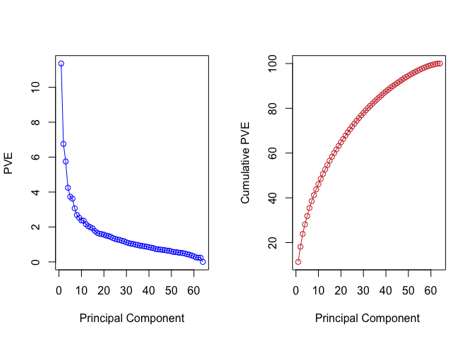
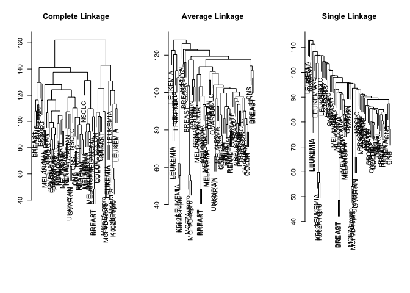
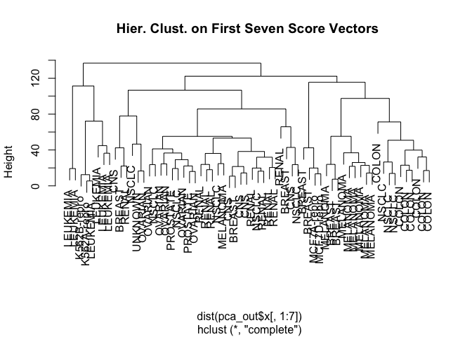

pca\_clustering\_example.Rmd
================

PCA and Clustering Example: Genomic Data
========================================

### In this lab, we'll use PCA and clustering on the `NCI60` cancer data, which consists of 6,830 gene measurements on 64 cancer cell lines.

``` r
# load data
library(ISLR)
nci_labs = NCI60$labs
nci_data = NCI60$data
dim(nci_data)
```

    ## [1]   64 6830

``` r
# frequencies of cancer types
table(nci_labs)
```

    ## nci_labs
    ##      BREAST         CNS       COLON K562A-repro K562B-repro    LEUKEMIA 
    ##           7           5           7           1           1           6 
    ## MCF7A-repro MCF7D-repro    MELANOMA       NSCLC     OVARIAN    PROSTATE 
    ##           1           1           8           9           6           2 
    ##       RENAL     UNKNOWN 
    ##           9           1

#### Let's start our analysis with PCA

``` r
pca_out = prcomp(nci_data, scale=T)  # scale variables to have SD 1 (maybe not necessary)


# plotting code not working :(

# function that assigns a distinct color to each element of a numeric vector, for plotting
#colors = function(vec) {
#  cols = rainbow(length(unique(vec)))
#  return(cols[as.numeric(as.vector(vec))])
#}

# plot 
#par(mfrow = c(1, 2))

#plot(pca_out$x[, 1:2], col=colors(nci_labs), pch=19, xlab="Z1", ylab="Z2")

#plot(pca_out$x[, c(1,3)], col=colors(nci_labs), pch=19, xlab="Z1", ylab="Z3")
```

``` r
# check PVE
summary(pca_out)
```

    ## Importance of components:
    ##                            PC1      PC2      PC3      PC4      PC5
    ## Standard deviation     27.8535 21.48136 19.82046 17.03256 15.97181
    ## Proportion of Variance  0.1136  0.06756  0.05752  0.04248  0.03735
    ## Cumulative Proportion   0.1136  0.18115  0.23867  0.28115  0.31850
    ##                             PC6      PC7      PC8      PC9     PC10
    ## Standard deviation     15.72108 14.47145 13.54427 13.14400 12.73860
    ## Proportion of Variance  0.03619  0.03066  0.02686  0.02529  0.02376
    ## Cumulative Proportion   0.35468  0.38534  0.41220  0.43750  0.46126
    ##                            PC11     PC12     PC13     PC14     PC15
    ## Standard deviation     12.68672 12.15769 11.83019 11.62554 11.43779
    ## Proportion of Variance  0.02357  0.02164  0.02049  0.01979  0.01915
    ## Cumulative Proportion   0.48482  0.50646  0.52695  0.54674  0.56590
    ##                            PC16     PC17     PC18     PC19    PC20
    ## Standard deviation     11.00051 10.65666 10.48880 10.43518 10.3219
    ## Proportion of Variance  0.01772  0.01663  0.01611  0.01594  0.0156
    ## Cumulative Proportion   0.58361  0.60024  0.61635  0.63229  0.6479
    ##                            PC21    PC22    PC23    PC24    PC25    PC26
    ## Standard deviation     10.14608 10.0544 9.90265 9.64766 9.50764 9.33253
    ## Proportion of Variance  0.01507  0.0148 0.01436 0.01363 0.01324 0.01275
    ## Cumulative Proportion   0.66296  0.6778 0.69212 0.70575 0.71899 0.73174
    ##                           PC27   PC28    PC29    PC30    PC31    PC32
    ## Standard deviation     9.27320 9.0900 8.98117 8.75003 8.59962 8.44738
    ## Proportion of Variance 0.01259 0.0121 0.01181 0.01121 0.01083 0.01045
    ## Cumulative Proportion  0.74433 0.7564 0.76824 0.77945 0.79027 0.80072
    ##                           PC33    PC34    PC35    PC36    PC37    PC38
    ## Standard deviation     8.37305 8.21579 8.15731 7.97465 7.90446 7.82127
    ## Proportion of Variance 0.01026 0.00988 0.00974 0.00931 0.00915 0.00896
    ## Cumulative Proportion  0.81099 0.82087 0.83061 0.83992 0.84907 0.85803
    ##                           PC39    PC40    PC41   PC42    PC43   PC44
    ## Standard deviation     7.72156 7.58603 7.45619 7.3444 7.10449 7.0131
    ## Proportion of Variance 0.00873 0.00843 0.00814 0.0079 0.00739 0.0072
    ## Cumulative Proportion  0.86676 0.87518 0.88332 0.8912 0.89861 0.9058
    ##                           PC45   PC46    PC47    PC48    PC49    PC50
    ## Standard deviation     6.95839 6.8663 6.80744 6.64763 6.61607 6.40793
    ## Proportion of Variance 0.00709 0.0069 0.00678 0.00647 0.00641 0.00601
    ## Cumulative Proportion  0.91290 0.9198 0.92659 0.93306 0.93947 0.94548
    ##                           PC51    PC52    PC53    PC54    PC55    PC56
    ## Standard deviation     6.21984 6.20326 6.06706 5.91805 5.91233 5.73539
    ## Proportion of Variance 0.00566 0.00563 0.00539 0.00513 0.00512 0.00482
    ## Cumulative Proportion  0.95114 0.95678 0.96216 0.96729 0.97241 0.97723
    ##                           PC57   PC58    PC59    PC60    PC61    PC62
    ## Standard deviation     5.47261 5.2921 5.02117 4.68398 4.17567 4.08212
    ## Proportion of Variance 0.00438 0.0041 0.00369 0.00321 0.00255 0.00244
    ## Cumulative Proportion  0.98161 0.9857 0.98940 0.99262 0.99517 0.99761
    ##                           PC63      PC64
    ## Standard deviation     4.04124 2.148e-14
    ## Proportion of Variance 0.00239 0.000e+00
    ## Cumulative Proportion  1.00000 1.000e+00

``` r
# plot pve
pve = 100*pca_out$sdev^2 / sum(pca_out$sdev^2)
par(mfrow=c(1,2))
plot(pve, type="o", ylab="PVE", xlab="Principal Component", col =" blue ")
plot(cumsum(pve), type="o", ylab="Cumulative PVE", xlab="Principal Component ", col =" brown3 ")
```



Based on these plots, it seems that after about the 7th PC, there is a substantial decrease in the variance explained by each PC. Given this, it might not be worth trying to include more PCs in the low-dimensional representation of our data!

#### Let's cluster the data hierarchically now!

``` r
# standardize data to have mean 0 and SD 1
standard_data = scale(nci_data)

# Use euclidean distance and complete, single, and average linkage
par(mfrow=c(1,3))
data.dist = dist(standard_data)  # euclidean distance
plot(hclust(data.dist), labels=nci_labs, main="Complete Linkage", xlab="", sub="",ylab="")
plot(hclust(data.dist, method="average"), labels=nci_labs, main="Average Linkage", xlab="", sub="", ylab="")
plot(hclust(data.dist, method="single"), labels=nci_labs, main="Single Linkage", xlab="", sub="", ylab="")
```



So now we have our 3 dendrograms! Yes, they are hard to read (and I'm not exactly sure how to fix this... a better picture is on p. 411 of the book). It seems that single linkage isn't yielding balanced clusters. That is, there is a large cluster with many observations "tacked on" one-by-one. However, complete and average linkage seem to give us more balanced clusters. This may be preferrable.

Now we must cut the dendrograms.

``` r
hc_out = hclust(dist(standard_data))
hc_clusters = cutree(hc_out, 4)  # specifying that we want to cut at the level which will yield 4 clusters
table(hc_clusters, nci_labs)
```

    ##            nci_labs
    ## hc_clusters BREAST CNS COLON K562A-repro K562B-repro LEUKEMIA MCF7A-repro
    ##           1      2   3     2           0           0        0           0
    ##           2      3   2     0           0           0        0           0
    ##           3      0   0     0           1           1        6           0
    ##           4      2   0     5           0           0        0           1
    ##            nci_labs
    ## hc_clusters MCF7D-repro MELANOMA NSCLC OVARIAN PROSTATE RENAL UNKNOWN
    ##           1           0        8     8       6        2     8       1
    ##           2           0        0     1       0        0     1       0
    ##           3           0        0     0       0        0     0       0
    ##           4           1        0     0       0        0     0       0

We see some interesting patterns from this table. For example, all leukemia cell lines lie in cluster 3, all melanoma in cluster 1, and all ovarian in cluster 1. Meanwhile, breast cancer cell lines are spread over 3 clusters.

Let's plot the cut that resulted in these 4 clusters.

``` r
par(mfrow=c(1,1))
plot(hc_out, labels=nci_labs) > abline(h=139, col="red")  
```


    ## logical(0)

``` r
# nice summary of what we've done
hc_out
```

    ## 
    ## Call:
    ## hclust(d = dist(standard_data))
    ## 
    ## Cluster method   : complete 
    ## Distance         : euclidean 
    ## Number of objects: 64

To check against the other clustering method we've seen, let's examine the results of K-means clustering with K=4.

``` r
set.seed(2)
k_means_out = kmeans(standard_data, 4, nstart=20)
k_means_clusters = k_means_out$cluster
table(k_means_clusters, hc_clusters)
```

    ##                 hc_clusters
    ## k_means_clusters  1  2  3  4
    ##                1 11  0  0  9
    ##                2 20  7  0  0
    ##                3  9  0  0  0
    ##                4  0  0  8  0

We see a few discrepancies here. For example, of all observations in the K-means first cluster, 11 are in the hierarchically clustered first cluster, and 9 in its 4th. And, The third K-means cluster is identical to the first hierarchically clustered cluster. Hence, we see that these clustering methods can give pretty different results!

To finish the lab, we'll go full circle and end up back on PCA. Let's hierarchically cluster on the first few principal component score vectors!

``` r
hc_pca_mix = hclust(dist(pca_out$x[, 1:7]))  # Use first 7 PC score vectors
plot(hc_pca_mix, labels=nci_labs, main="Hier. Clust. on First Seven Score Vectors ")
```



``` r
table(cutree(hc_pca_mix, 4), nci_labs)
```

    ##    nci_labs
    ##     BREAST CNS COLON K562A-repro K562B-repro LEUKEMIA MCF7A-repro
    ##   1      3   5     0           0           0        0           0
    ##   2      2   0     7           0           0        0           0
    ##   3      0   0     0           1           1        6           0
    ##   4      2   0     0           0           0        0           1
    ##    nci_labs
    ##     MCF7D-repro MELANOMA NSCLC OVARIAN PROSTATE RENAL UNKNOWN
    ##   1           0        1     6       6        2     9       1
    ##   2           0        7     3       0        0     0       0
    ##   3           0        0     0       0        0     0       0
    ##   4           1        0     0       0        0     0       0

It's not surprising that these results are different than those we obtained when clustering on the entire data set. Sometimes, this can give better results since PCA can help us find the true "signal" in the data. And alternatively, we could've performed K-means clustering on the first few PCs. This concludes this example, and the book!

Unsupervised learning has been an interesting topic, and especially this lab in particular, because there's no real way to assess which method performed better on the data. Why? There are no answers! And yes, although I read this in the book, it becomes more apparent when you're coding, doing analysis yourself and realizing that your analysis doesn't really come to any specific conclusions. I guess this is the challenge of unsupervised learning, though, and it's certainly different and interesint.

This is it for ISl. It's been a fun journey through the book, and I will be definitely be applying many of these techniques to some other personal projects!
