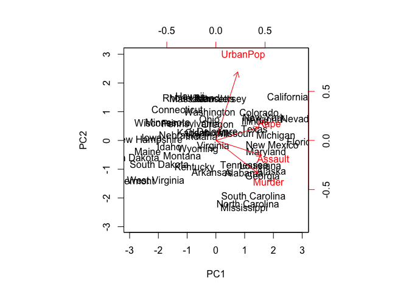
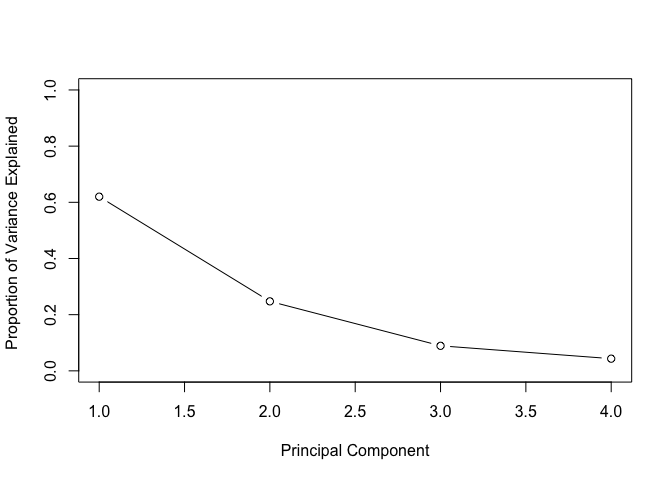

principal\_components\_analysis.Rmd
================

Lab: Principal Components Analysis (PCA)
========================================

### In this lab, we'll perform PCA on the `USArrests` data set.

``` r
# examine data
head(USArrests)
```

    ##            Murder Assault UrbanPop Rape
    ## Alabama      13.2     236       58 21.2
    ## Alaska       10.0     263       48 44.5
    ## Arizona       8.1     294       80 31.0
    ## Arkansas      8.8     190       50 19.5
    ## California    9.0     276       91 40.6
    ## Colorado      7.9     204       78 38.7

``` r
states = row.names(USArrests)
states
```

    ##  [1] "Alabama"        "Alaska"         "Arizona"        "Arkansas"      
    ##  [5] "California"     "Colorado"       "Connecticut"    "Delaware"      
    ##  [9] "Florida"        "Georgia"        "Hawaii"         "Idaho"         
    ## [13] "Illinois"       "Indiana"        "Iowa"           "Kansas"        
    ## [17] "Kentucky"       "Louisiana"      "Maine"          "Maryland"      
    ## [21] "Massachusetts"  "Michigan"       "Minnesota"      "Mississippi"   
    ## [25] "Missouri"       "Montana"        "Nebraska"       "Nevada"        
    ## [29] "New Hampshire"  "New Jersey"     "New Mexico"     "New York"      
    ## [33] "North Carolina" "North Dakota"   "Ohio"           "Oklahoma"      
    ## [37] "Oregon"         "Pennsylvania"   "Rhode Island"   "South Carolina"
    ## [41] "South Dakota"   "Tennessee"      "Texas"          "Utah"          
    ## [45] "Vermont"        "Virginia"       "Washington"     "West Virginia" 
    ## [49] "Wisconsin"      "Wyoming"

``` r
apply(USArrests, MARGIN=2, mean)
```

    ##   Murder  Assault UrbanPop     Rape 
    ##    7.788  170.760   65.540   21.232

``` r
apply(USArrests, MARGIN=2, var)
```

    ##     Murder    Assault   UrbanPop       Rape 
    ##   18.97047 6945.16571  209.51878   87.72916

Our variables have very different means and variances. Furthermore, `UbranPop` is the percentage of the population living in urban areas, while the others are arrests per 100,000 people for that particular crime. So, they aren't on the same scale. These facts mean we should standardize the variables--otherwise, `Assault` woul be given far too much weight in the analysis since it has the highest mean and variance.

``` r
# standardize
pca_out = prcomp(USArrests, center=T, scale=T)  # make sure to standardize variables
names(pca_out)
```

    ## [1] "sdev"     "rotation" "center"   "scale"    "x"

``` r
# examine loading vectors
pca_out$rotation
```

    ##                 PC1        PC2        PC3         PC4
    ## Murder   -0.5358995  0.4181809 -0.3412327  0.64922780
    ## Assault  -0.5831836  0.1879856 -0.2681484 -0.74340748
    ## UrbanPop -0.2781909 -0.8728062 -0.3780158  0.13387773
    ## Rape     -0.5434321 -0.1673186  0.8177779  0.08902432

So, we see there are 4 principal components. The attribute `x` has the 4 score vectors as its columns.

``` r
head(pca_out$x)
```

    ##                   PC1        PC2         PC3          PC4
    ## Alabama    -0.9756604  1.1220012 -0.43980366  0.154696581
    ## Alaska     -1.9305379  1.0624269  2.01950027 -0.434175454
    ## Arizona    -1.7454429 -0.7384595  0.05423025 -0.826264240
    ## Arkansas    0.1399989  1.1085423  0.11342217 -0.180973554
    ## California -2.4986128 -1.5274267  0.59254100 -0.338559240
    ## Colorado   -1.4993407 -0.9776297  1.08400162  0.001450164

``` r
# plot first two principal components
biplot(pca_out, scale=0)  # scale=0 ensures arrows are scaled to represent loadings 
```


We can flip the signs of the arrows to make the chart more interpretable, since principal components are unique up to a sign change.

``` r
pca_out$rotation = -pca_out$rotation
pca_out$x = -pca_out$x
biplot(pca_out, scale=0)
```



This looks better! We interpret this the following way: The first loading vector places sigfnicant and near equal weight on `Rape`, `Assault`, and `Murder`. owever, it places much less on `UrbanPop`. This is because they are all centered around 1.5 or so. Statistically, this fact means that these variables are correlated with each other, which intuitively isn't much of a surprise. On the other hand, the opposite is true for the second loading vector, which heavily weighs `UrbanPop` and the others much less.

Now, we ask how we can find the proportion of variance explained (PVE) by each principal component. We can do so like this:

``` r
# SDs of each principal component
pca_out$sdev
```

    ## [1] 1.5748783 0.9948694 0.5971291 0.4164494

``` r
pca_var = pca_out$sdev^2  # square the SDs to get variances
pve = pca_var/sum(pca_var)  # calculate proportions
pve
```

    ## [1] 0.62006039 0.24744129 0.08914080 0.04335752

``` r
# Plot PVE
plot(pve, xlab="Principal Component", ylab="Proportion of Variance Explained ", ylim=c(0,1), type='b')
```



``` r
# use cumsum() to flip the graph
plot(cumsum(pve), xlab="Principal Component ", ylab=" Cumulative Proportion of Variance Explained ", ylim=c(0,1), type='b')  
```


From these plots, we see that between almost 90% of the variance in the data is captured by the first two principal components. This number seems pretty good, although we always have to keep in mind that there's no general rule for choosing the number of PCs to represent a data set. However, since about 90% is a lot and lets us make nice 2D plots, that's we've stuck with here!

Most importantly, though, we've seen how PCA allows us to find a good low-dimensional representation of the data. By low-dimensional, we mean that we have found a way to represent our data with 2 variables rather than the original 4. And by "good", we mean that although the representation isn't perfect, it captures enough of the variance of the data well enough to be useful.
